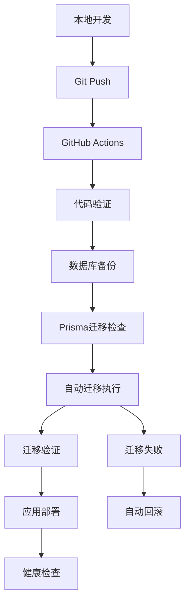

# 数据库同步优化项目 - 对齐文档 (ALIGNMENT)

## 📋 项目概述

### 原始需求
1. **移除所有的Supabase PostgreSQL文档内容，更新到最新**
2. **本地数据库改动在GitHub Action部署阶段能够自动同步的完整评估方案**
3. **Review当前数据库连接方案**

### 项目特性规范
- **项目名称**: Easy ERP 数据库同步优化
- **技术栈**: Next.js 14 + React 18 + TypeScript + Prisma + MySQL
- **数据库**: MySQL (本地 + 生产环境)
- **部署方式**: GitHub Actions + ECS 本地构建
- **ORM**: Prisma 6.13.0+

## 🎯 需求理解确认

### 1. 文档清理需求
**目标**: 移除所有PostgreSQL/Supabase引用，统一为MySQL

**发现的问题文档**:
- `.trae/rules/project_rules.md`: "数据库: Supabase PostgreSQL"
- `docs/包装任务进度实时计算/ALIGNMENT_*.md`: "PostgreSQL (Supabase)"
- `docs/产品成本字段增加/ALIGNMENT_*.md`: "Supabase PostgreSQL"
- `docs/purchase-orders-statistics/ALIGNMENT_*.md`: "PostgreSQL (Supabase)"
- 多个设计文档中的架构图引用PostgreSQL

**清理范围**: 约15个文档文件需要更新

### 2. 数据库自动同步需求
**目标**: 设计本地数据库改动自动同步到生产环境的方案

**当前状态分析**:
- ✅ **已有基础**: GitHub Actions部署流程完整
- ✅ **已有工具**: Prisma迁移系统
- ❌ **缺失环节**: 自动化数据库同步机制
- ❌ **风险控制**: 缺乏迁移前验证和回滚机制

**技术约束**:
- 必须保证生产数据安全
- 需要支持零停机部署
- 必须有完整的回滚机制
- 需要详细的操作日志

### 3. 数据库连接方案评估
**目标**: 评估当前连接架构的合理性和安全性

**当前架构**:
```
本地开发 → MySQL (localhost:3306)
生产环境 → MySQL (ECS内部)
GitHub Actions → SSH连接 → ECS服务器
```

**发现的问题**:
- 脚本同时支持PostgreSQL和MySQL，增加复杂性
- 环境变量传递链路较长
- 缺乏连接池配置
- 缺乏数据库监控

## 🔍 边界确认

### 任务范围 (IN SCOPE)
1. **文档更新**: 清理所有PostgreSQL引用，统一为MySQL
2. **同步方案设计**: 设计自动化数据库同步流程
3. **架构评估**: 评估并优化数据库连接方案
4. **风险控制**: 设计备份和回滚机制
5. **文档输出**: 完整的技术方案和操作手册

### 任务边界 (OUT OF SCOPE)
1. **不修改代码**: 本次仅输出方案，不实际修改代码
2. **不改变数据库**: 不修改现有数据库结构
3. **不影响业务**: 不涉及业务逻辑变更
4. **不迁移数据**: 不涉及数据迁移或转换

## ❓ 疑问澄清

### 已解决的疑问
1. **Q**: 为什么MySQL项目中出现PostgreSQL语法？
   **A**: 历史原因，项目初期可能考虑过Supabase，后改为MySQL但文档未同步更新

2. **Q**: 当前部署流程是否支持数据库迁移？
   **A**: 部分支持，有Prisma迁移检查但缺乏自动化同步机制

3. **Q**: 生产环境数据库备份策略如何？
   **A**: 有备份脚本但未集成到自动化流程中

### 待确认的关键决策点
1. **数据库同步策略**: 是否采用蓝绿部署还是滚动更新？
2. **迁移失败处理**: 自动回滚还是人工干预？
3. **同步频率**: 每次部署都同步还是按需同步？
4. **监控告警**: 需要什么级别的数据库监控？

## 🏗️ 技术实现方案概述

### 1. 文档清理方案
- 批量搜索替换PostgreSQL → MySQL
- 更新架构图和技术栈描述
- 统一环境变量示例
- 更新部署文档

### 2. 数据库同步方案


### 3. 连接优化方案
- 简化脚本，移除PostgreSQL支持
- 优化环境变量传递
- 增加连接池配置
- 添加数据库监控

## 📊 技术约束和集成方案

### 现有系统约束
- **Prisma版本**: 6.13.0+，支持MySQL
- **Node.js版本**: 18+
- **部署环境**: ECS + PM2
- **CI/CD**: GitHub Actions

### 集成要求
- 与现有部署流程无缝集成
- 保持向后兼容性
- 不影响现有功能
- 支持手动和自动触发

## ✅ 验收标准

### 文档更新验收
- [ ] 所有PostgreSQL引用已清理
- [ ] 技术栈描述统一为MySQL
- [ ] 架构图更新完成
- [ ] 环境变量示例正确

### 同步方案验收
- [ ] 完整的自动化同步流程设计
- [ ] 详细的风险控制机制
- [ ] 完整的回滚策略
- [ ] 操作手册和故障排除指南

### 架构评估验收
- [ ] 当前方案优缺点分析
- [ ] 优化建议和实施计划
- [ ] 安全性和性能评估
- [ ] 监控和告警方案

## 🎯 质量门控

### 需求边界清晰度
- ✅ 任务范围明确定义
- ✅ 边界限制清楚标识
- ✅ 交付物明确列出

### 技术方案对齐度
- ✅ 与现有架构兼容
- ✅ 技术栈约束明确
- ✅ 集成方案可行

### 验收标准具体性
- ✅ 可测试的验收条件
- ✅ 明确的质量要求
- ✅ 完整的交付清单

### 关键假设确认
- ✅ 项目使用MySQL数据库
- ✅ 不修改现有代码逻辑
- ✅ 保持现有部署流程
- ✅ 优先考虑数据安全

---

**文档版本**: v1.0  
**创建时间**: 2025-01-22  
**状态**: ✅ 对齐完成，等待架构设计阶段