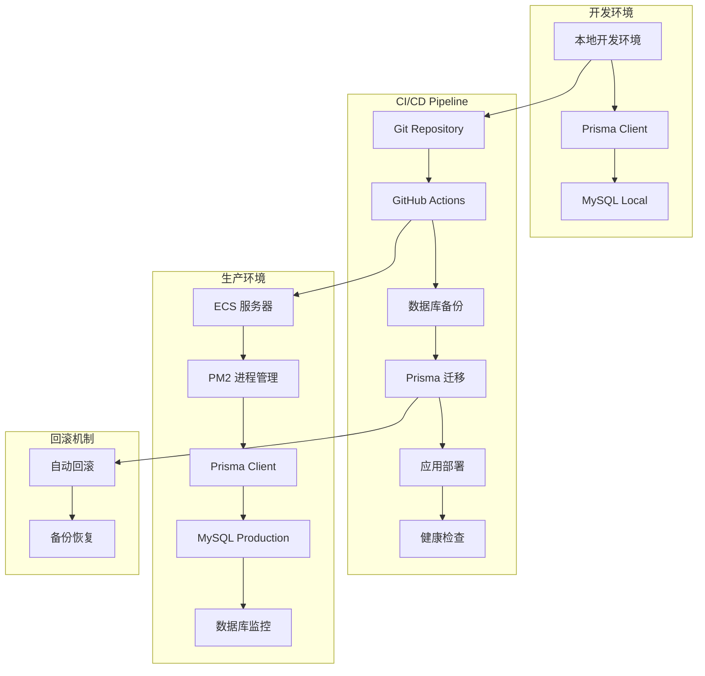
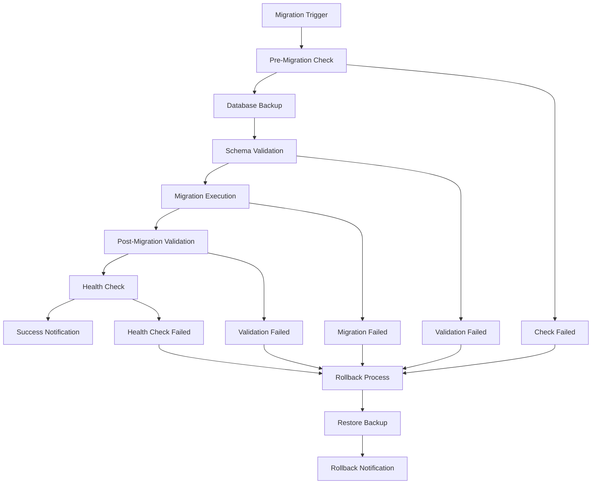
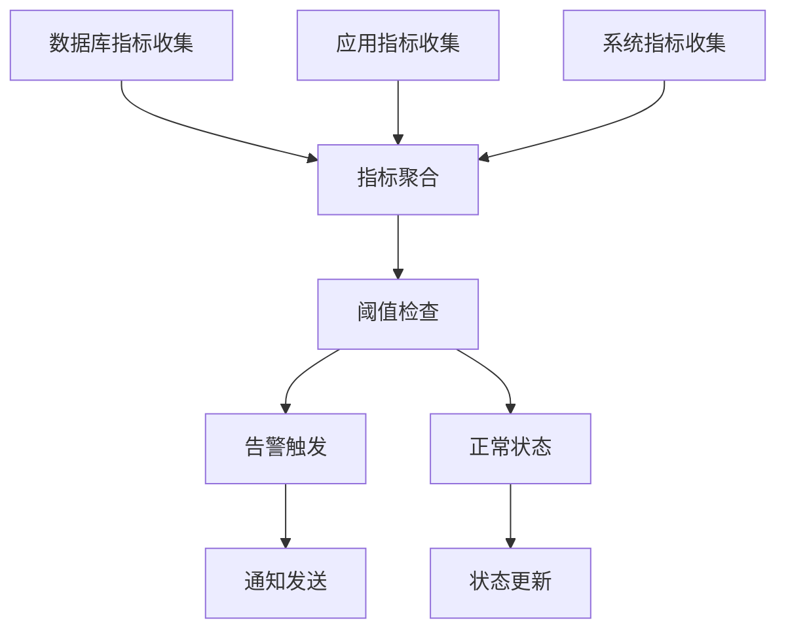
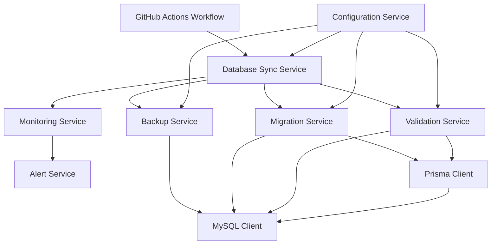
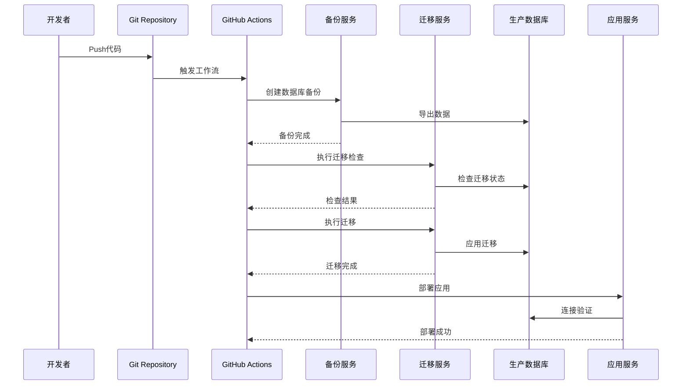
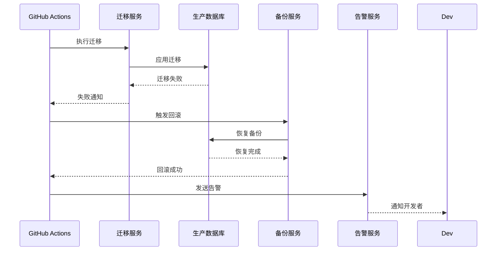

# 数据库同步优化项目 - 架构设计文档 (DESIGN)

## 📐 整体架构设计

### 系统架构图


### 分层设计

#### 1. 数据层 (Data Layer)
- **本地数据库**: MySQL 8.0+ (开发环境)
- **生产数据库**: MySQL 8.0+ (ECS内部)
- **ORM层**: Prisma 6.13.0+
- **迁移管理**: Prisma Migrate

#### 2. 应用层 (Application Layer)
- **Web应用**: Next.js 14 + React 18
- **API路由**: Next.js API Routes
- **业务逻辑**: TypeScript 服务层
- **进程管理**: PM2

#### 3. 部署层 (Deployment Layer)
- **CI/CD**: GitHub Actions
- **容器化**: ECS (非Docker)
- **代码部署**: Git Pull + Build
- **进程管理**: PM2 Restart

#### 4. 监控层 (Monitoring Layer)
- **应用监控**: PM2 监控
- **数据库监控**: MySQL 性能监控
- **日志管理**: 应用日志 + 数据库日志
- **告警机制**: 关键指标告警

## 🔧 核心组件设计

### 1. 数据库同步组件

#### 组件架构


#### 核心接口定义
```typescript
// 数据库同步服务接口
interface DatabaseSyncService {
  // 执行数据库迁移
  executeMigration(): Promise<MigrationResult>
  
  // 验证迁移状态
  validateMigration(): Promise<ValidationResult>
  
  // 创建数据库备份
  createBackup(): Promise<BackupResult>
  
  // 恢复数据库备份
  restoreBackup(backupId: string): Promise<RestoreResult>
  
  // 健康检查
  healthCheck(): Promise<HealthStatus>
}

// 迁移结果类型
interface MigrationResult {
  success: boolean
  migrationId: string
  appliedMigrations: string[]
  executionTime: number
  error?: string
}

// 验证结果类型
interface ValidationResult {
  isValid: boolean
  schemaVersion: string
  inconsistencies: string[]
  warnings: string[]
}
```

### 2. 备份恢复组件

#### 备份策略设计


#### 备份接口定义
```typescript
// 备份服务接口
interface BackupService {
  // 创建完整备份
  createFullBackup(): Promise<BackupInfo>
  
  // 创建增量备份
  createIncrementalBackup(): Promise<BackupInfo>
  
  // 列出可用备份
  listBackups(): Promise<BackupInfo[]>
  
  // 恢复指定备份
  restoreBackup(backupId: string): Promise<RestoreResult>
  
  // 验证备份完整性
  validateBackup(backupId: string): Promise<boolean>
}

// 备份信息类型
interface BackupInfo {
  id: string
  timestamp: Date
  type: 'full' | 'incremental'
  size: number
  schemaVersion: string
  filePath: string
}
```

### 3. 监控告警组件

#### 监控架构


## 🔄 模块依赖关系

### 依赖关系图


### 模块职责划分

#### 1. 核心服务模块
- **DatabaseSyncService**: 协调整个同步流程
- **MigrationService**: 执行Prisma迁移
- **BackupService**: 管理数据库备份和恢复
- **ValidationService**: 验证数据库状态和迁移结果

#### 2. 支撑服务模块
- **ConfigurationService**: 管理配置和环境变量
- **MonitoringService**: 收集和分析监控数据
- **AlertService**: 处理告警和通知
- **LoggingService**: 统一日志管理

#### 3. 基础设施模块
- **MySQLClient**: 数据库连接和操作
- **PrismaClient**: ORM操作和迁移
- **FileSystemService**: 文件操作和存储
- **NotificationService**: 消息通知

## 📊 数据流向设计

### 正常部署流程


### 异常回滚流程


## 🛡️ 异常处理策略

### 异常分类和处理

#### 1. 迁移前异常
- **环境检查失败**: 停止部署，发送告警
- **备份创建失败**: 停止部署，手动介入
- **权限验证失败**: 停止部署，检查配置

#### 2. 迁移中异常
- **SQL语法错误**: 立即停止，保持原状态
- **数据约束冲突**: 立即停止，分析数据
- **连接超时**: 重试3次，失败则停止

#### 3. 迁移后异常
- **验证失败**: 自动回滚到备份
- **应用启动失败**: 回滚数据库，重启应用
- **健康检查失败**: 回滚并告警

### 回滚策略

#### 自动回滚条件
```typescript
// 自动回滚触发条件
interface AutoRollbackConditions {
  migrationTimeout: number        // 迁移超时时间
  validationFailure: boolean      // 验证失败
  healthCheckFailure: boolean     // 健康检查失败
  criticalErrorThreshold: number  // 严重错误阈值
}

// 回滚执行策略
interface RollbackStrategy {
  maxRetryAttempts: number       // 最大重试次数
  rollbackTimeout: number        // 回滚超时时间
  preserveUserData: boolean      // 保留用户数据
  notificationChannels: string[] // 通知渠道
}
```

## 🔧 接口契约定义

### GitHub Actions 集成接口

#### 工作流步骤接口
```yaml
# 数据库同步步骤定义
steps:
  - name: "Database Backup"
    run: "npm run db:backup"
    
  - name: "Migration Check"
    run: "npm run db:migration:check"
    
  - name: "Migration Execute"
    run: "npm run db:migration:deploy"
    
  - name: "Migration Validate"
    run: "npm run db:migration:validate"
    
  - name: "Health Check"
    run: "npm run db:health:check"
```

#### 环境变量接口
```typescript
// 必需的环境变量
interface DatabaseSyncEnvironment {
  DATABASE_URL: string           // 数据库连接字符串
  BACKUP_STORAGE_PATH: string    // 备份存储路径
  MIGRATION_TIMEOUT: string      // 迁移超时时间
  ROLLBACK_ENABLED: string       // 是否启用自动回滚
  NOTIFICATION_WEBHOOK: string   // 通知Webhook地址
}
```

### Prisma 集成接口

#### 迁移命令接口
```typescript
// Prisma 迁移操作接口
interface PrismaMigrationOps {
  // 检查迁移状态
  checkMigrationStatus(): Promise<MigrationStatus>
  
  // 部署待处理迁移
  deployPendingMigrations(): Promise<DeployResult>
  
  // 重置数据库
  resetDatabase(): Promise<ResetResult>
  
  // 生成迁移文件
  generateMigration(name: string): Promise<GenerateResult>
}
```

## 🎯 设计原则验证

### 1. 严格按照任务范围
- ✅ 仅设计方案，不涉及代码实现
- ✅ 专注于数据库同步优化
- ✅ 保持现有系统架构不变

### 2. 与现有系统架构一致
- ✅ 基于现有GitHub Actions流程
- ✅ 使用现有Prisma ORM
- ✅ 保持MySQL数据库不变
- ✅ 集成现有PM2部署方式

### 3. 复用现有组件和模式
- ✅ 复用现有备份脚本逻辑
- ✅ 复用现有数据库连接检查
- ✅ 复用现有环境变量管理
- ✅ 复用现有日志和监控

### 4. 设计可行性验证
- ✅ 技术栈兼容性确认
- ✅ 部署流程可行性验证
- ✅ 回滚机制安全性确认
- ✅ 监控告警完整性验证

## 📋 质量门控检查

### 架构图清晰准确
- ✅ 整体架构图完整
- ✅ 组件关系图清晰
- ✅ 数据流向图准确
- ✅ 异常处理流程完整

### 接口定义完整
- ✅ 核心服务接口定义
- ✅ 数据类型接口定义
- ✅ 环境变量接口定义
- ✅ 集成接口定义

### 与现有系统无冲突
- ✅ 不修改现有数据库结构
- ✅ 不影响现有业务逻辑
- ✅ 不改变现有部署流程
- ✅ 向后兼容性保证

### 设计可行性验证
- ✅ 技术实现可行
- ✅ 性能影响可控
- ✅ 安全风险可控
- ✅ 运维复杂度合理

---

**文档版本**: v1.0  
**创建时间**: 2025-01-22  
**依赖文档**: ALIGNMENT_database_sync_optimization.md  
**状态**: ✅ 架构设计完成，等待原子化任务拆分