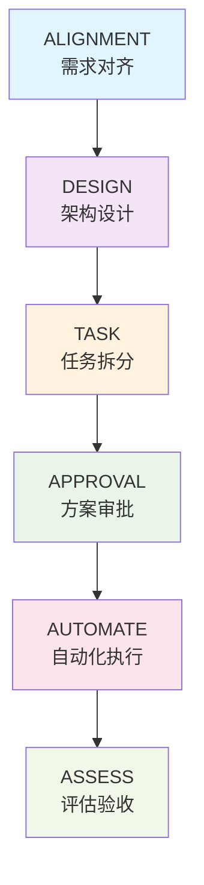
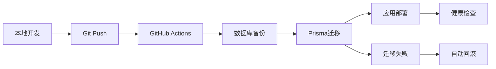

# 数据库同步优化项目 - 项目概览

## 📋 项目简介

本项目旨在解决Easy ERP系统中的数据库同步优化问题，通过6A工作流完成了完整的需求分析、架构设计和任务规划。

### 🎯 核心目标
1. **清理历史遗留**: 移除所有Supabase PostgreSQL文档内容，统一为MySQL
2. **自动化同步**: 设计本地数据库改动在GitHub Action部署阶段自动同步的方案
3. **架构优化**: 评估并优化当前数据库连接方案

### 🏗️ 技术栈
- **数据库**: MySQL 8.0+
- **ORM**: Prisma 6.13.0+
- **部署**: GitHub Actions + ECS
- **框架**: Next.js 14 + React 18 + TypeScript

## 📚 文档结构

### 6A工作流文档
```
docs/database-sync-optimization/
├── ALIGNMENT_database_sync_optimization.md    # 对齐文档 - 需求确认
├── DESIGN_database_sync_optimization.md      # 设计文档 - 架构方案
├── TASK_database_sync_optimization.md        # 任务文档 - 原子化拆分
├── APPROVAL_database_sync_optimization.md    # 审批文档 - 方案确认
└── README.md                                 # 项目概览 (本文档)
```

### 文档关系图


## 🎯 执行计划

### 任务概览
| 阶段 | 任务 | 描述 | 复杂度 | 预估工时 |
|------|------|------|--------|----------|
| **阶段1** | T1 | 文档内容清理 | 简单 | 2小时 |
| | T2 | 脚本代码清理 | 中等 | 3小时 |
| | T3 | 配置文件清理 | 简单 | 1小时 |
| **阶段2** | T4 | 数据库同步方案设计 | 复杂 | 6小时 |
| | T5 | 备份恢复方案设计 | 中等 | 4小时 |
| | T6 | 监控告警方案设计 | 中等 | 4小时 |
| **阶段3** | T7 | GitHub Actions集成方案 | 复杂 | 5小时 |
| | T8 | 完整技术方案输出 | 中等 | 3小时 |
| **总计** | | **8个任务** | | **28小时** |

### 执行策略
- **并行优化**: 阶段1和阶段2内的任务可并行执行
- **质量控制**: 每个阶段完成后进行质量门控检查
- **风险管控**: 重点关注T4和T7两个高风险任务
- **渐进交付**: 分阶段交付，便于验证和调整

## 🔍 关键设计亮点

### 1. 自动化数据库同步架构


### 2. 多层安全保障
- **备份机制**: 每次同步前自动备份
- **验证机制**: 迁移前后多层验证
- **回滚机制**: 异常情况自动回滚
- **监控机制**: 实时监控同步状态

### 3. 风险控制策略
- **数据安全**: 强制备份 + 多层验证
- **系统稳定**: 渐进集成 + 向后兼容
- **配置安全**: 配置备份 + 语法验证

## 📊 预期收益

### 直接收益
1. **文档统一**: 清理历史遗留，技术栈描述统一
2. **自动化提升**: 数据库同步自动化，减少人工操作
3. **架构优化**: 数据库连接方案优化，提升性能和安全性

### 间接收益
1. **开发效率**: 减少手动数据库操作，提升开发效率
2. **部署可靠性**: 自动化同步减少部署错误
3. **运维成本**: 减少数据库相关的运维工作量
4. **技术债务**: 清理历史技术债务，提升代码质量

## 🚨 风险提醒

### 高风险项目
- **T4 (数据库同步方案)**: 涉及数据安全，需要详细的异常处理
- **T7 (GitHub Actions集成)**: 集成复杂度高，需要充分测试

### 缓解措施
- 强制备份机制保护数据安全
- 渐进式集成降低系统风险
- 多层验证确保方案可靠性
- 完善的回滚机制应对异常情况

## ✅ 当前状态

### 已完成阶段
- ✅ **Align (对齐)**: 需求分析和边界确认完成
- ✅ **Architect (架构)**: 系统架构和组件设计完成
- ✅ **Atomize (原子化)**: 任务拆分和依赖分析完成
- ✅ **Approve (审批)**: 方案审批和风险评估完成

### 待执行阶段
- ⏳ **Automate (自动化)**: 等待用户确认后开始执行
- ⏳ **Assess (评估)**: 执行完成后进行质量评估

## 🎯 下一步行动

### 用户确认事项
1. **方案确认**: 是否同意按照APPROVAL文档执行？
2. **执行顺序**: 是否按照3阶段8任务的顺序执行？
3. **质量标准**: 是否同意文档中定义的验收标准？
4. **风险接受**: 是否接受已识别的风险和缓解措施？

### 执行准备
一旦用户确认，将立即开始执行：
1. **阶段1**: 并行执行T1、T2、T3 (文档和脚本清理)
2. **阶段2**: 并行执行T4、T5、T6 (方案设计)
3. **阶段3**: 串行执行T7、T8 (集成和输出)

---

**项目状态**: 🟡 **等待用户确认执行**  
**完成进度**: 4/6 阶段 (67%)  
**预估剩余时间**: 28小时 (3-4个工作日)  
**风险等级**: 🟨 **中等风险，可控**  

**📞 联系方式**: 如有疑问，请随时询问具体的技术细节或实施方案。