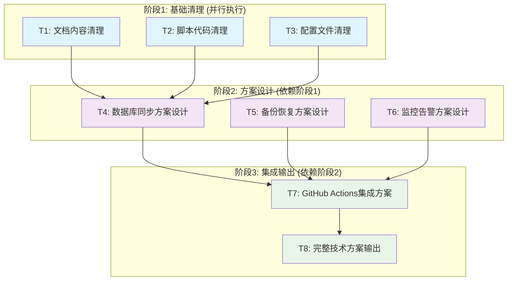

# 数据库同步优化项目 - 任务拆分文档 (TASK)

## 📋 任务概览

基于DESIGN文档，将数据库同步优化项目拆分为8个原子任务，按依赖关系分为3个执行阶段。

### 任务依赖关系图

## 🎯 原子任务详细定义

### 阶段1: 基础清理任务

#### T1: 文档内容清理

**任务描述**: 清理所有文档中的PostgreSQL/Supabase引用，统一更新为MySQL

**输入契约**:
- 前置依赖: 无
- 输入数据: 现有项目文档文件
- 环境依赖: 文件系统访问权限

**输出契约**:
- 输出数据: 更新后的文档文件
- 交付物: 
  - 更新的项目规则文档
  - 更新的设计文档(15个文件)
  - 更新的对齐文档
  - 文档变更清单
- 验收标准:
  - [ ] 所有PostgreSQL引用已替换为MySQL
  - [ ] 所有Supabase引用已移除
  - [ ] 技术栈描述统一
  - [ ] 架构图更新完成

**实现约束**:
- 技术栈: 文本处理工具
- 接口规范: 保持文档格式不变
- 质量要求: 内容准确性，无遗漏

**依赖关系**:
- 后置任务: T4 (数据库同步方案设计)
- 并行任务: T2, T3

---

#### T2: 脚本代码清理

**任务描述**: 简化数据库相关脚本，移除PostgreSQL支持，优化MySQL专用逻辑

**输入契约**:
- 前置依赖: 无
- 输入数据: 
  - `scripts/check-database-connection.sh`
  - `scripts/db-backup.sh`
  - 相关脚本文件
- 环境依赖: Shell脚本执行环境

**输出契约**:
- 输出数据: 优化后的脚本文件
- 交付物:
  - 简化的数据库连接检查脚本
  - 优化的备份脚本
  - 脚本变更说明文档
- 验收标准:
  - [ ] 移除所有PostgreSQL相关代码
  - [ ] MySQL逻辑优化完成
  - [ ] 脚本功能验证通过
  - [ ] 代码注释更新

**实现约束**:
- 技术栈: Bash Shell
- 接口规范: 保持脚本调用接口不变
- 质量要求: 向后兼容，功能完整

**依赖关系**:
- 后置任务: T4 (数据库同步方案设计)
- 并行任务: T1, T3

---

#### T3: 配置文件清理

**任务描述**: 更新配置文件和环境变量示例，统一为MySQL配置

**输入契约**:
- 前置依赖: 无
- 输入数据:
  - `.env.example`
  - `prisma/schema.prisma`
  - 相关配置文件
- 环境依赖: 文件系统访问权限

**输出契约**:
- 输出数据: 更新后的配置文件
- 交付物:
  - 统一的环境变量示例
  - 更新的Prisma配置
  - 配置变更说明
- 验收标准:
  - [ ] 环境变量示例统一为MySQL
  - [ ] 数据库连接字符串格式正确
  - [ ] 配置注释更新完成
  - [ ] 示例配置可用性验证

**实现约束**:
- 技术栈: 配置文件格式
- 接口规范: 保持配置结构不变
- 质量要求: 配置正确性，示例完整性

**依赖关系**:
- 后置任务: T4 (数据库同步方案设计)
- 并行任务: T1, T2

---

### 阶段2: 方案设计任务

#### T4: 数据库同步方案设计

**任务描述**: 设计完整的自动化数据库同步流程和实施方案

**输入契约**:
- 前置依赖: T1, T2, T3 (基础清理完成)
- 输入数据:
  - 现有GitHub Actions配置
  - 现有Prisma迁移流程
  - 清理后的脚本和文档
- 环境依赖: 对现有系统的理解

**输出契约**:
- 输出数据: 数据库同步技术方案
- 交付物:
  - 自动化同步流程设计
  - 迁移执行策略
  - 异常处理机制
  - 实施步骤指南
- 验收标准:
  - [ ] 同步流程设计完整
  - [ ] 异常处理覆盖全面
  - [ ] 与现有系统集成方案清晰
  - [ ] 实施可行性验证

**实现约束**:
- 技术栈: Prisma, GitHub Actions, MySQL
- 接口规范: 与现有部署流程兼容
- 质量要求: 方案完整性，可操作性

**依赖关系**:
- 前置任务: T1, T2, T3
- 后置任务: T7 (GitHub Actions集成方案)
- 并行任务: T5, T6

---

#### T5: 备份恢复方案设计

**任务描述**: 设计完整的数据库备份和恢复机制

**输入契约**:
- 前置依赖: T2 (脚本代码清理)
- 输入数据:
  - 现有备份脚本
  - 数据库结构信息
  - 存储容量约束
- 环境依赖: 数据库访问权限，存储空间

**输出契约**:
- 输出数据: 备份恢复技术方案
- 交付物:
  - 备份策略设计
  - 恢复流程设计
  - 备份存储管理
  - 备份验证机制
- 验收标准:
  - [ ] 备份策略完整
  - [ ] 恢复流程可靠
  - [ ] 存储管理合理
  - [ ] 验证机制有效

**实现约束**:
- 技术栈: MySQL, Shell脚本
- 接口规范: 与同步流程集成
- 质量要求: 数据安全性，恢复可靠性

**依赖关系**:
- 前置任务: T2 (间接依赖)
- 后置任务: T7 (GitHub Actions集成方案)
- 并行任务: T4, T6

---

#### T6: 监控告警方案设计

**任务描述**: 设计数据库和同步过程的监控告警机制

**输入契约**:
- 前置依赖: 无直接依赖
- 输入数据:
  - 现有监控配置
  - 关键性能指标
  - 告警渠道信息
- 环境依赖: 监控工具访问权限

**输出契约**:
- 输出数据: 监控告警技术方案
- 交付物:
  - 监控指标定义
  - 告警规则设计
  - 通知机制设计
  - 监控仪表板设计
- 验收标准:
  - [ ] 监控指标覆盖完整
  - [ ] 告警规则合理
  - [ ] 通知机制可靠
  - [ ] 仪表板直观易用

**实现约束**:
- 技术栈: 监控工具，通知服务
- 接口规范: 与现有监控系统集成
- 质量要求: 监控准确性，告警及时性

**依赖关系**:
- 前置任务: 无
- 后置任务: T7 (GitHub Actions集成方案)
- 并行任务: T4, T5

---

### 阶段3: 集成输出任务

#### T7: GitHub Actions集成方案

**任务描述**: 设计完整的GitHub Actions工作流集成方案

**输入契约**:
- 前置依赖: T4, T5, T6 (方案设计完成)
- 输入数据:
  - 现有GitHub Actions配置
  - 数据库同步方案
  - 备份恢复方案
  - 监控告警方案
- 环境依赖: GitHub Actions环境

**输出契约**:
- 输出数据: GitHub Actions集成方案
- 交付物:
  - 工作流配置设计
  - 步骤执行顺序
  - 环境变量配置
  - 集成测试方案
- 验收标准:
  - [ ] 工作流设计完整
  - [ ] 步骤依赖关系正确
  - [ ] 环境变量配置完整
  - [ ] 集成方案可行

**实现约束**:
- 技术栈: GitHub Actions, YAML
- 接口规范: 与现有工作流兼容
- 质量要求: 集成可靠性，配置正确性

**依赖关系**:
- 前置任务: T4, T5, T6
- 后置任务: T8 (完整技术方案输出)
- 并行任务: 无

---

#### T8: 完整技术方案输出

**任务描述**: 整合所有子方案，输出完整的技术实施方案

**输入契约**:
- 前置依赖: T7 (GitHub Actions集成方案)
- 输入数据:
  - 所有子任务输出
  - 集成方案设计
  - 测试验证结果
- 环境依赖: 文档编写环境

**输出契约**:
- 输出数据: 完整技术方案文档
- 交付物:
  - 综合技术方案
  - 实施操作手册
  - 风险评估报告
  - 后续优化建议
- 验收标准:
  - [ ] 方案文档完整
  - [ ] 操作手册详细
  - [ ] 风险评估全面
  - [ ] 优化建议实用

**实现约束**:
- 技术栈: 文档工具
- 接口规范: 标准技术文档格式
- 质量要求: 文档完整性，可操作性

**依赖关系**:
- 前置任务: T7
- 后置任务: 无
- 并行任务: 无

## 📊 任务复杂度评估

### 复杂度矩阵
| 任务 | 技术复杂度 | 业务复杂度 | 集成复杂度 | 总体评估 | 预估工时 |
|------|------------|------------|------------|----------|----------|
| T1   | 低         | 低         | 低         | 简单     | 2小时    |
| T2   | 中         | 低         | 中         | 中等     | 3小时    |
| T3   | 低         | 低         | 低         | 简单     | 1小时    |
| T4   | 高         | 高         | 高         | 复杂     | 6小时    |
| T5   | 中         | 中         | 中         | 中等     | 4小时    |
| T6   | 中         | 中         | 中         | 中等     | 4小时    |
| T7   | 高         | 中         | 高         | 复杂     | 5小时    |
| T8   | 低         | 高         | 低         | 中等     | 3小时    |

### 风险评估

#### 高风险任务
- **T4 (数据库同步方案设计)**: 涉及数据安全，需要详细的异常处理设计
- **T7 (GitHub Actions集成方案)**: 集成复杂度高，需要考虑多种部署场景

#### 中风险任务
- **T2 (脚本代码清理)**: 需要保证向后兼容性
- **T5 (备份恢复方案设计)**: 涉及数据恢复，需要充分测试
- **T6 (监控告警方案设计)**: 需要平衡监控粒度和性能影响

#### 低风险任务
- **T1 (文档内容清理)**: 纯文档操作，风险较低
- **T3 (配置文件清理)**: 配置更新，影响范围可控
- **T8 (完整技术方案输出)**: 文档整合，技术风险低

## 🔄 执行策略

### 并行执行优化
- **阶段1**: T1, T2, T3 可以并行执行，提高效率
- **阶段2**: T4, T5, T6 可以并行执行，但T4是关键路径
- **阶段3**: T7, T8 必须串行执行

### 质量控制点
1. **阶段1完成检查**: 确保所有PostgreSQL引用已清理
2. **阶段2完成检查**: 确保各子方案设计完整且相互兼容
3. **阶段3完成检查**: 确保集成方案可行且文档完整

### 异常处理策略
- **任务阻塞**: 记录问题，寻求澄清，从阻塞点继续
- **依赖冲突**: 重新评估依赖关系，调整执行顺序
- **质量不达标**: 返回修改，重新验收

## ✅ 整体验收标准

### 功能完整性
- [ ] 所有8个原子任务完成
- [ ] 任务间依赖关系满足
- [ ] 输出交付物齐全

### 质量标准
- [ ] 文档内容准确无误
- [ ] 技术方案可行性验证
- [ ] 集成方案兼容性确认
- [ ] 风险控制措施完备

### 可操作性
- [ ] 实施步骤清晰明确
- [ ] 操作手册详细完整
- [ ] 异常处理流程完备
- [ ] 验收标准具体可测

---

**文档版本**: v1.0  
**创建时间**: 2025-01-22  
**依赖文档**: DESIGN_database_sync_optimization.md  
**状态**: ✅ 任务拆分完成，等待审批确认