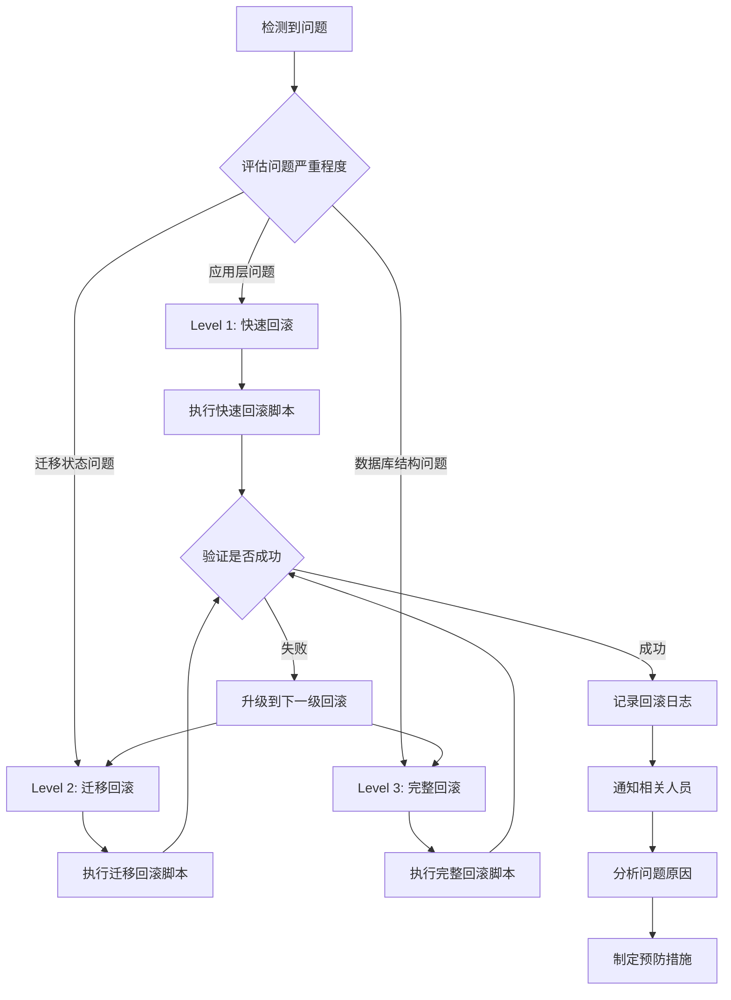

# 生产环境回滚计划

**文档版本**: v1.0.0  
**创建时间**: 2024-01-21  
**适用场景**: 数据库迁移冲突修复失败时的应急回滚  
**风险等级**: 🔴 高风险操作  
**执行权限**: 数据库管理员 + 系统管理员  

## ⚠️ 回滚触发条件

### 立即回滚情况

- 🚨 **数据库连接异常超过 5 分钟**
- 🚨 **应用服务无法正常启动超过 10 分钟**
- 🚨 **关键业务功能完全不可用**
- 🚨 **数据完整性检查失败**
- 🚨 **用户报告严重业务影响**
- 🚨 **监控系统触发 P0 级别告警**

### 考虑回滚情况

- ⚠️ **性能指标严重下降 (>50%)**
- ⚠️ **错误率异常增长 (>10%)**
- ⚠️ **部分功能异常但不影响核心业务**
- ⚠️ **修复操作超过预期时间窗口**

## 回滚策略分级

### Level 1: 应用层回滚 (最轻量)

**适用场景**: 应用启动失败，数据库状态正常

**回滚时间**: 2-5 分钟

**操作步骤**:
```bash
# 1. 停止当前应用
pm2 stop easy-erp

# 2. 回滚到上一个稳定版本
git reset --hard HEAD~1

# 3. 重新生成 Prisma 客户端
npx prisma generate

# 4. 重启应用
pm2 start easy-erp

# 5. 验证服务状态
curl -f http://localhost:3000/api/health
```

**验证标准**:
- ✅ PM2 显示服务正常运行
- ✅ 健康检查接口返回 200
- ✅ 关键业务功能可用

### Level 2: 迁移状态回滚 (中等风险)

**适用场景**: 迁移状态异常，需要重置迁移记录

**回滚时间**: 5-10 分钟

**操作步骤**:
```bash
# 1. 停止应用服务
pm2 stop easy-erp

# 2. 备份当前迁移状态
mysql -h [host] -u [user] -p[password] [database] -e "SELECT * FROM _prisma_migrations;" > /tmp/current_migrations.sql

# 3. 删除问题迁移记录
mysql -h [host] -u [user] -p[password] [database] -e "DELETE FROM _prisma_migrations WHERE migration_name = '20250821015630_add_shipment_file_field';"

# 4. 重置 Prisma 状态
npx prisma migrate resolve --rolled-back 20250821015630_add_shipment_file_field

# 5. 验证迁移状态
npx prisma migrate status

# 6. 重新生成客户端并启动
npx prisma generate
pm2 start easy-erp

# 7. 验证服务状态
curl -f http://localhost:3000/api/health
```

**验证标准**:
- ✅ 迁移状态显示正常
- ✅ 数据库连接正常
- ✅ 应用服务正常启动
- ✅ 业务功能正常

### Level 3: 数据库完整回滚 (高风险)

**适用场景**: 数据库结构或数据出现异常

**回滚时间**: 15-30 分钟

**⚠️ 重要警告**: 此操作会导致数据丢失，仅在极端情况下使用

**前置条件**:
- 必须有完整的数据库备份
- 必须有技术负责人和业务负责人双重确认
- 必须评估数据丢失的业务影响

**操作步骤**:
```bash
# 1. 立即停止所有服务
pm2 stop all

# 2. 确认备份文件存在且完整
ls -lh /backup/[backup_timestamp]/full_backup.sql

# 3. 创建当前数据库快照 (以防需要恢复)
mysqldump -h [host] -u [user] -p[password] [database] > /backup/emergency_snapshot_$(date +%Y%m%d_%H%M%S).sql

# 4. 恢复数据库到备份状态
mysql -h [host] -u [user] -p[password] [database] < /backup/[backup_timestamp]/full_backup.sql

# 5. 恢复迁移状态
rm -rf prisma/migrations
cp -r /backup/[backup_timestamp]/migrations_backup prisma/migrations
cp /backup/[backup_timestamp]/schema_backup.prisma prisma/schema.prisma

# 6. 重新生成 Prisma 客户端
npx prisma generate

# 7. 启动服务
pm2 start easy-erp

# 8. 全面验证
curl -f http://localhost:3000/api/health
npx prisma migrate status
```

**验证标准**:
- ✅ 数据库完全恢复到备份状态
- ✅ 迁移状态与备份一致
- ✅ 应用服务正常启动
- ✅ 所有业务功能正常
- ✅ 数据完整性检查通过

## 自动化回滚脚本

### 快速回滚脚本 (Level 1)

```bash
#!/bin/bash
# 文件: /scripts/quick-rollback.sh
set -euo pipefail

echo "🚨 执行快速回滚 (Level 1)"
echo "时间: $(date '+%Y-%m-%d %H:%M:%S')"

# 记录回滚原因
read -p "请输入回滚原因: " rollback_reason
echo "$(date '+%Y-%m-%d %H:%M:%S') - 快速回滚执行，原因: $rollback_reason" >> /var/log/rollback.log

# 1. 停止应用
echo "停止应用服务..."
pm2 stop easy-erp

# 2. 回滚代码
echo "回滚到上一个稳定版本..."
git reset --hard HEAD~1

# 3. 重新生成客户端
echo "重新生成 Prisma 客户端..."
npx prisma generate

# 4. 启动应用
echo "启动应用服务..."
pm2 start easy-erp

# 5. 验证服务
echo "验证服务状态..."
sleep 10
if curl -f http://localhost:3000/api/health > /dev/null 2>&1; then
    echo "✅ 快速回滚成功"
    echo "$(date '+%Y-%m-%d %H:%M:%S') - 快速回滚成功" >> /var/log/rollback.log
else
    echo "❌ 快速回滚失败，需要执行更深层次的回滚"
    echo "$(date '+%Y-%m-%d %H:%M:%S') - 快速回滚失败" >> /var/log/rollback.log
    exit 1
fi
```

### 迁移回滚脚本 (Level 2)

```bash
#!/bin/bash
# 文件: /scripts/migration-rollback.sh
set -euo pipefail

echo "🚨 执行迁移回滚 (Level 2)"
echo "时间: $(date '+%Y-%m-%d %H:%M:%S')"

# 记录回滚原因
read -p "请输入回滚原因: " rollback_reason
echo "$(date '+%Y-%m-%d %H:%M:%S') - 迁移回滚执行，原因: $rollback_reason" >> /var/log/rollback.log

# 数据库连接信息 (从环境变量读取)
source .env
DB_HOST=$(echo $DATABASE_URL | sed -n 's/.*@\([^:]*\):.*/\1/p')
DB_USER=$(echo $DATABASE_URL | sed -n 's/.*:\/\/\([^:]*\):.*/\1/p')
DB_PASS=$(echo $DATABASE_URL | sed -n 's/.*:\/\/[^:]*:\([^@]*\)@.*/\1/p')
DB_NAME=$(echo $DATABASE_URL | sed -n 's/.*\/\([^?]*\).*/\1/p')

# 1. 停止应用
echo "停止应用服务..."
pm2 stop easy-erp

# 2. 备份当前迁移状态
echo "备份当前迁移状态..."
mysql -h $DB_HOST -u $DB_USER -p$DB_PASS $DB_NAME -e "SELECT * FROM _prisma_migrations;" > /tmp/rollback_migrations_$(date +%Y%m%d_%H%M%S).sql

# 3. 删除问题迁移记录
echo "删除问题迁移记录..."
mysql -h $DB_HOST -u $DB_USER -p$DB_PASS $DB_NAME -e "DELETE FROM _prisma_migrations WHERE migration_name = '20250821015630_add_shipment_file_field';"

# 4. 重置 Prisma 状态
echo "重置 Prisma 迁移状态..."
npx prisma migrate resolve --rolled-back 20250821015630_add_shipment_file_field

# 5. 验证迁移状态
echo "验证迁移状态..."
npx prisma migrate status

# 6. 重新生成客户端
echo "重新生成 Prisma 客户端..."
npx prisma generate

# 7. 启动应用
echo "启动应用服务..."
pm2 start easy-erp

# 8. 验证服务
echo "验证服务状态..."
sleep 15
if curl -f http://localhost:3000/api/health > /dev/null 2>&1; then
    echo "✅ 迁移回滚成功"
    echo "$(date '+%Y-%m-%d %H:%M:%S') - 迁移回滚成功" >> /var/log/rollback.log
else
    echo "❌ 迁移回滚失败，需要执行完整数据库回滚"
    echo "$(date '+%Y-%m-%d %H:%M:%S') - 迁移回滚失败" >> /var/log/rollback.log
    exit 1
fi
```

### 完整回滚脚本 (Level 3)

```bash
#!/bin/bash
# 文件: /scripts/full-rollback.sh
set -euo pipefail

echo "🚨🚨🚨 执行完整回滚 (Level 3) 🚨🚨🚨"
echo "⚠️  此操作将导致数据丢失！"
echo "时间: $(date '+%Y-%m-%d %H:%M:%S')"

# 强制确认
read -p "请输入 'CONFIRM_FULL_ROLLBACK' 以确认执行: " confirm
if [ "$confirm" != "CONFIRM_FULL_ROLLBACK" ]; then
    echo "❌ 确认失败，操作已取消"
    exit 1
fi

# 记录回滚原因
read -p "请输入回滚原因: " rollback_reason
echo "$(date '+%Y-%m-%d %H:%M:%S') - 完整回滚执行，原因: $rollback_reason" >> /var/log/rollback.log

# 查找最新的备份文件
BACKUP_DIR=$(ls -td /backup/*/ | head -1)
if [ ! -d "$BACKUP_DIR" ]; then
    echo "❌ 未找到备份目录"
    exit 1
fi

echo "使用备份目录: $BACKUP_DIR"

# 数据库连接信息
source .env
DB_HOST=$(echo $DATABASE_URL | sed -n 's/.*@\([^:]*\):.*/\1/p')
DB_USER=$(echo $DATABASE_URL | sed -n 's/.*:\/\/\([^:]*\):.*/\1/p')
DB_PASS=$(echo $DATABASE_URL | sed -n 's/.*:\/\/[^:]*:\([^@]*\)@.*/\1/p')
DB_NAME=$(echo $DATABASE_URL | sed -n 's/.*\/\([^?]*\).*/\1/p')

# 1. 停止所有服务
echo "停止所有服务..."
pm2 stop all

# 2. 创建紧急快照
echo "创建紧急数据库快照..."
EMERGENCY_SNAPSHOT="/backup/emergency_snapshot_$(date +%Y%m%d_%H%M%S).sql"
mysqldump -h $DB_HOST -u $DB_USER -p$DB_PASS $DB_NAME > $EMERGENCY_SNAPSHOT
echo "紧急快照已保存到: $EMERGENCY_SNAPSHOT"

# 3. 恢复数据库
echo "恢复数据库到备份状态..."
if [ -f "$BACKUP_DIR/full_backup.sql" ]; then
    mysql -h $DB_HOST -u $DB_USER -p$DB_PASS $DB_NAME < $BACKUP_DIR/full_backup.sql
    echo "✅ 数据库恢复完成"
else
    echo "❌ 备份文件不存在: $BACKUP_DIR/full_backup.sql"
    exit 1
fi

# 4. 恢复迁移状态
echo "恢复迁移状态..."
if [ -d "$BACKUP_DIR/migrations_backup" ]; then
    rm -rf prisma/migrations
    cp -r $BACKUP_DIR/migrations_backup prisma/migrations
    echo "✅ 迁移目录恢复完成"
else
    echo "❌ 迁移备份不存在: $BACKUP_DIR/migrations_backup"
    exit 1
fi

if [ -f "$BACKUP_DIR/schema_backup.prisma" ]; then
    cp $BACKUP_DIR/schema_backup.prisma prisma/schema.prisma
    echo "✅ Schema 文件恢复完成"
else
    echo "❌ Schema 备份不存在: $BACKUP_DIR/schema_backup.prisma"
    exit 1
fi

# 5. 重新生成 Prisma 客户端
echo "重新生成 Prisma 客户端..."
npx prisma generate

# 6. 启动服务
echo "启动应用服务..."
pm2 start easy-erp

# 7. 全面验证
echo "全面验证系统状态..."
sleep 20

# 验证应用健康
if curl -f http://localhost:3000/api/health > /dev/null 2>&1; then
    echo "✅ 应用健康检查通过"
else
    echo "❌ 应用健康检查失败"
    exit 1
fi

# 验证迁移状态
if npx prisma migrate status | grep -q "Database schema is up to date"; then
    echo "✅ 迁移状态验证通过"
else
    echo "❌ 迁移状态验证失败"
    exit 1
fi

echo "✅ 完整回滚成功完成"
echo "$(date '+%Y-%m-%d %H:%M:%S') - 完整回滚成功" >> /var/log/rollback.log
echo "📋 紧急快照位置: $EMERGENCY_SNAPSHOT"
echo "📋 使用的备份: $BACKUP_DIR"
```

## 回滚决策流程图



## 回滚后验证清单

### 立即验证 (回滚完成后 5 分钟内)

- [ ] **服务状态**: PM2 显示所有服务正常运行
- [ ] **应用响应**: 健康检查接口返回 200 状态码
- [ ] **数据库连接**: 数据库查询正常执行
- [ ] **迁移状态**: Prisma 迁移状态正常
- [ ] **错误日志**: 无新的严重错误日志

### 功能验证 (回滚完成后 15 分钟内)

- [ ] **用户认证**: 登录功能正常
- [ ] **核心业务**: 主要业务流程可用
- [ ] **数据读写**: 数据查询和更新正常
- [ ] **文件上传**: 文件操作功能正常
- [ ] **API 接口**: 关键 API 接口响应正常

### 性能验证 (回滚完成后 30 分钟内)

- [ ] **响应时间**: API 响应时间在正常范围内
- [ ] **数据库性能**: 查询执行时间正常
- [ ] **系统资源**: CPU、内存使用率正常
- [ ] **并发处理**: 系统可以处理正常负载
- [ ] **监控指标**: 所有监控指标恢复正常

### 业务验证 (回滚完成后 1 小时内)

- [ ] **用户反馈**: 无用户报告新问题
- [ ] **业务流程**: 完整业务流程测试通过
- [ ] **数据一致性**: 关键业务数据完整性检查
- [ ] **第三方集成**: 外部系统集成正常
- [ ] **定时任务**: 后台任务正常执行

## 回滚后恢复计划

### 短期恢复 (24 小时内)

1. **问题分析**
   - 详细分析回滚原因
   - 识别问题根本原因
   - 评估影响范围

2. **数据评估**
   - 评估回滚期间的数据丢失
   - 制定数据恢复计划
   - 与业务团队确认数据影响

3. **修复方案**
   - 制定新的修复方案
   - 在测试环境验证方案
   - 准备更安全的部署计划

### 中期恢复 (3-7 天内)

1. **流程改进**
   - 完善部署前检查流程
   - 加强测试覆盖率
   - 改进监控和告警机制

2. **技术改进**
   - 优化数据库迁移策略
   - 完善自动化回滚机制
   - 加强环境一致性管理

3. **团队建设**
   - 进行事故复盘
   - 加强团队培训
   - 完善应急响应流程

### 长期预防 (1 个月内)

1. **基础设施**
   - 建设更完善的监控体系
   - 实施蓝绿部署策略
   - 完善灾备恢复机制

2. **开发流程**
   - 实施更严格的代码审查
   - 完善自动化测试流程
   - 建立渐进式发布机制

3. **组织建设**
   - 建立专门的 SRE 团队
   - 完善事故响应机制
   - 建立持续改进文化

## 通知和沟通机制

### 回滚执行期间

**立即通知** (回滚开始时):
- 技术负责人
- 产品负责人
- 运维团队
- 客服团队

**通知内容**:
```
🚨 生产环境回滚通知

时间: [回滚开始时间]
级别: Level [1/2/3]
原因: [简要描述]
预计恢复时间: [预估时间]
影响范围: [业务影响描述]
负责人: [主要负责人]

我们正在执行紧急回滚，请暂时避免进行相关操作。
```

### 回滚完成后

**成功通知**:
```
✅ 生产环境回滚完成

回滚时间: [开始时间] - [结束时间]
回滚级别: Level [1/2/3]
验证状态: 通过
服务状态: 正常

系统已恢复正常运行，可以继续正常使用。
详细报告将在 2 小时内提供。
```

**失败通知**:
```
❌ 生产环境回滚失败

当前状态: [详细描述]
下一步行动: [具体计划]
预计恢复时间: [更新预估]

我们正在执行更深层次的恢复措施，请继续等待。
```

## 回滚日志和审计

### 日志记录要求

所有回滚操作必须记录以下信息:

- **操作时间**: 精确到秒的时间戳
- **操作人员**: 执行人员和授权人员
- **回滚级别**: Level 1/2/3
- **回滚原因**: 详细的问题描述
- **执行步骤**: 每个操作步骤的记录
- **验证结果**: 每个验证点的结果
- **影响评估**: 业务影响和数据影响
- **恢复时间**: 完整的时间线记录

### 审计要求

- 所有 Level 2 和 Level 3 回滚必须进行事后审计
- 审计报告必须在 48 小时内完成
- 审计报告必须包含改进建议
- 审计结果必须与相关团队分享

---

**执行授权**:
- [ ] 技术负责人审核确认
- [ ] 数据库管理员审核确认
- [ ] 系统管理员审核确认
- [ ] 产品负责人知情确认

**风险声明**:
- 本回滚计划已经过充分的风险评估
- 所有操作都有详细的验证步骤
- 团队已做好应急响应准备
- 在极端情况下可能需要更长的恢复时间

> 🚨 **重要提醒**: 回滚是最后的手段，应该优先尝试修复而不是回滚。只有在修复风险大于回滚风险时才应该执行回滚操作。