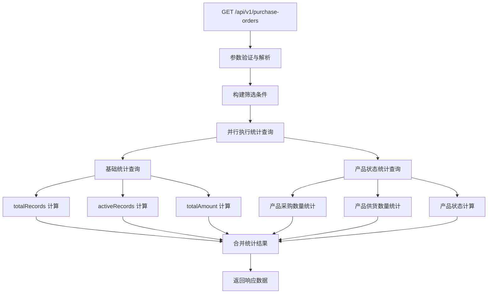
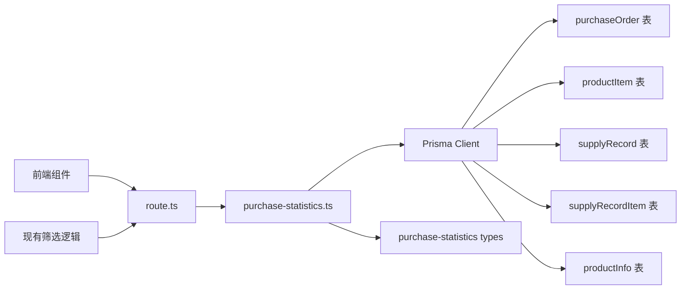
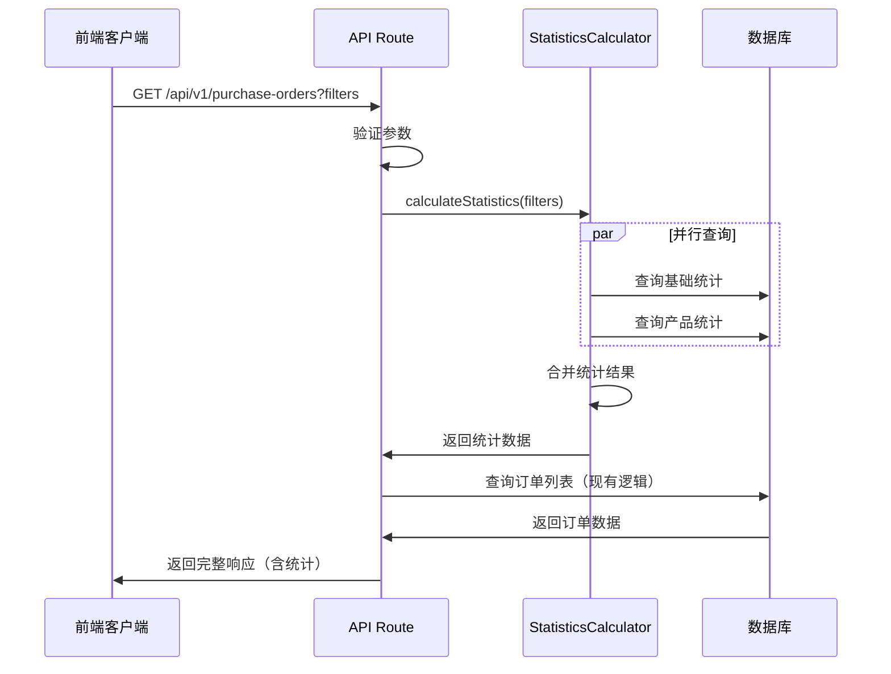

# 采购订单列表接口 Statistics 字段架构设计文档

## 整体架构图



## 分层设计

### 1. 接口层 (API Layer)
- **文件**: `/src/app/api/v1/purchase-orders/route.ts`
- **职责**: 接收请求、参数验证、调用业务逻辑、返回响应

### 2. 业务逻辑层 (Business Logic Layer)
- **文件**: `/src/lib/purchase-statistics.ts` (新建)
- **职责**: 统计数据计算、业务规则处理

### 3. 数据访问层 (Data Access Layer)
- **文件**: 使用现有 Prisma Client
- **职责**: 数据库查询、事务管理

## 核心组件设计

### 1. 类型定义

```typescript
// /src/types/purchase-statistics.ts
export interface PurchaseOrderStatistics {
  totalRecords: number;        // 总采购订单数（不受分页影响）
  activeRecords: number;       // 有效采购订单数
  totalAmount: number;         // 采购订单总金额
  productStatuses: ProductSupplyStatus[]; // 产品供货状态统计
}

export interface ProductSupplyStatus {
  productId: string;           // 产品ID
  productName?: string;        // 产品名称（可选）
  productSku?: string;         // 产品SKU（可选）
  purchaseQuantity: number;    // 采购总数量
  suppliedQuantity: number;    // 已供货数量
  availableQuantity: number;   // 可供货数量
  supplyProgress: number;      // 供货进度百分比 (0-100)
}

export interface PurchaseOrderQueryFilters {
  shopId?: number;
  supplierId?: string;
  status?: PurchaseOrderStatus;
  urgent?: boolean;
  operatorId?: string;
  startDate?: string;
  endDate?: string;
  productId?: string;
}
```

### 2. 统计计算器类

```typescript
// /src/lib/purchase-statistics.ts
import { PrismaClient } from '@/generated/prisma';
import { PurchaseOrderStatistics, PurchaseOrderQueryFilters, ProductSupplyStatus } from '@/types/purchase-statistics';

export class PurchaseOrderStatisticsCalculator {
  constructor(private prisma: PrismaClient) {}

  /**
   * 计算采购订单统计信息
   */
  async calculateStatistics(filters: PurchaseOrderQueryFilters): Promise<PurchaseOrderStatistics> {
    // 构建基础查询条件
    const whereCondition = this.buildWhereCondition(filters);
    
    // 并行执行统计查询
    const [basicStats, productStats] = await Promise.all([
      this.calculateBasicStatistics(whereCondition),
      this.calculateProductStatistics(whereCondition)
    ]);
    
    return {
      ...basicStats,
      productStatuses: productStats
    };
  }

  /**
   * 构建查询条件
   */
  private buildWhereCondition(filters: PurchaseOrderQueryFilters) {
    const where: any = {};
    
    if (filters.shopId) where.shopId = filters.shopId;
    if (filters.supplierId) where.supplierId = filters.supplierId;
    if (filters.status) where.status = filters.status;
    if (filters.urgent !== undefined) where.urgent = filters.urgent;
    if (filters.operatorId) where.operatorId = filters.operatorId;
    
    // 日期范围筛选
    if (filters.startDate || filters.endDate) {
      where.createdAt = {};
      if (filters.startDate) where.createdAt.gte = new Date(filters.startDate);
      if (filters.endDate) where.createdAt.lte = new Date(filters.endDate);
    }
    
    // 产品ID筛选（通过productItems关联）
    if (filters.productId) {
      where.productItems = {
        some: {
          productId: filters.productId
        }
      };
    }
    
    return where;
  }

  /**
   * 计算基础统计信息
   */
  private async calculateBasicStatistics(whereCondition: any) {
    const [totalCount, activeCount, amountSum] = await Promise.all([
      // 总记录数
      this.prisma.purchaseOrder.count({ where: whereCondition }),
      
      // 有效记录数（排除已取消状态）
      this.prisma.purchaseOrder.count({
        where: {
          ...whereCondition,
          status: { not: 'CANCELLED' }
        }
      }),
      
      // 总金额统计
      this.prisma.purchaseOrder.aggregate({
        where: whereCondition,
        _sum: { finalAmount: true }
      })
    ]);
    
    return {
      totalRecords: totalCount,
      activeRecords: activeCount,
      totalAmount: Number(amountSum._sum.finalAmount || 0)
    };
  }

  /**
   * 计算产品供货状态统计
   */
  private async calculateProductStatistics(whereCondition: any): Promise<ProductSupplyStatus[]> {
    // 获取所有相关产品的采购数量
    const purchaseStats = await this.prisma.productItem.groupBy({
      by: ['productId'],
      where: {
        relatedType: 'PurchaseOrder',
        relatedId: {
          in: await this.getPurchaseOrderIds(whereCondition)
        }
      },
      _sum: { quantity: true }
    });
    
    // 获取产品信息
    const productIds = purchaseStats.map(stat => stat.productId);
    const products = await this.prisma.productInfo.findMany({
      where: { id: { in: productIds } },
      select: { id: true, name: true, sku: true }
    });
    
    // 计算每个产品的供货统计
    const productStatuses: ProductSupplyStatus[] = [];
    
    for (const purchaseStat of purchaseStats) {
      const product = products.find(p => p.id === purchaseStat.productId);
      const purchaseQuantity = purchaseStat._sum.quantity || 0;
      
      // 计算已供货数量
      const suppliedQuantity = await this.getSuppliedQuantity(purchaseStat.productId, whereCondition);
      
      const availableQuantity = Math.max(0, purchaseQuantity - suppliedQuantity);
      const supplyProgress = purchaseQuantity > 0 ? Math.round((suppliedQuantity / purchaseQuantity) * 100) : 0;
      
      productStatuses.push({
        productId: purchaseStat.productId,
        productName: product?.name,
        productSku: product?.sku,
        purchaseQuantity,
        suppliedQuantity,
        availableQuantity,
        supplyProgress
      });
    }
    
    return productStatuses.sort((a, b) => b.purchaseQuantity - a.purchaseQuantity);
  }

  /**
   * 获取采购订单ID列表
   */
  private async getPurchaseOrderIds(whereCondition: any): Promise<string[]> {
    const orders = await this.prisma.purchaseOrder.findMany({
      where: whereCondition,
      select: { id: true }
    });
    return orders.map(order => order.id);
  }

  /**
   * 计算产品已供货数量
   */
  private async getSuppliedQuantity(productId: string, purchaseOrderWhereCondition: any): Promise<number> {
    // 获取相关采购订单ID
    const purchaseOrderIds = await this.getPurchaseOrderIds(purchaseOrderWhereCondition);
    
    // 统计该产品在这些采购订单中的供货数量
    const supplyStats = await this.prisma.supplyRecordItem.aggregate({
      where: {
        productId,
        supplyRecord: {
          purchaseOrderId: { in: purchaseOrderIds },
          status: 'active'
        }
      },
      _sum: { quantity: true }
    });
    
    return supplyStats._sum.quantity || 0;
  }
}
```

## 模块依赖关系图



## 接口契约定义

### 请求接口
```typescript
// GET /api/v1/purchase-orders
// 查询参数保持不变，新增统计信息返回

interface PurchaseOrderListRequest {
  page?: number;
  pageSize?: number;
  shopId?: number;
  supplierId?: string;
  status?: PurchaseOrderStatus;
  urgent?: boolean;
  operatorId?: string;
  startDate?: string;
  endDate?: string;
  productId?: string;
}
```

### 响应接口
```typescript
interface PurchaseOrderListResponse {
  code: number;
  msg: string;
  data: {
    orders: PurchaseOrderInfo[];     // 现有订单列表
    total: number;                   // 现有总数（分页用）
    page: number;                    // 现有页码
    pageSize: number;                // 现有页大小
    statistics: PurchaseOrderStatistics; // 新增统计信息
  };
}
```

## 数据流向图



## 异常处理策略

### 1. 统计查询失败处理
```typescript
try {
  const statistics = await calculator.calculateStatistics(filters);
  return { ...existingData, statistics };
} catch (error) {
  console.error('Statistics calculation failed:', error);
  // 返回默认统计数据，不影响主要功能
  return {
    ...existingData,
    statistics: {
      totalRecords: 0,
      activeRecords: 0,
      totalAmount: 0,
      productStatuses: []
    }
  };
}
```

### 2. 数据库连接异常
- 使用 Prisma 的自动重连机制
- 设置合理的查询超时时间
- 记录详细的错误日志

### 3. 大数据量处理
- 设置查询结果限制（productStatuses 最多返回 100 个产品）
- 使用数据库索引优化查询性能
- 考虑分页或缓存机制

## 性能优化策略

### 1. 数据库查询优化
```sql
-- 确保关键字段有索引
CREATE INDEX idx_purchase_orders_shop_status ON purchase_orders(shopId, status);
CREATE INDEX idx_product_items_related ON product_items(relatedType, relatedId, productId);
CREATE INDEX idx_supply_records_purchase_status ON supply_records(purchaseOrderId, status);
CREATE INDEX idx_supply_record_items_product ON supply_record_items(productId, supplyRecordId);
```

### 2. 查询并行化
- 基础统计和产品统计并行执行
- 使用 Promise.all 减少总查询时间

### 3. 结果缓存（可选）
```typescript
// 可考虑使用 Redis 缓存统计结果
const cacheKey = `purchase_stats_${JSON.stringify(filters)}`;
const cachedResult = await redis.get(cacheKey);
if (cachedResult) {
  return JSON.parse(cachedResult);
}
// ... 计算统计
await redis.setex(cacheKey, 300, JSON.stringify(result)); // 5分钟缓存
```

## 质量门控

### 1. 架构一致性检查
- ✅ 与现有 API 响应格式保持一致
- ✅ 使用现有的错误处理机制
- ✅ 遵循现有的代码组织结构

### 2. 性能要求
- ✅ 统计查询时间不超过 2 秒
- ✅ 不影响现有订单列表查询性能
- ✅ 支持并发请求处理

### 3. 数据准确性
- ✅ 统计数据与实际数据一致
- ✅ 筛选条件正确应用到统计计算
- ✅ 边界条件处理正确

### 4. 可扩展性
- ✅ 支持新增统计字段
- ✅ 支持新的筛选条件
- ✅ 代码结构清晰，易于维护

## 部署考虑

### 1. 数据库迁移
- 确保必要的索引已创建
- 验证现有数据的完整性

### 2. 向后兼容
- statistics 字段为新增字段，不影响现有客户端
- 现有 API 行为保持不变

### 3. 监控指标
- 统计查询执行时间
- 统计查询错误率
- API 整体响应时间变化

## 测试策略

### 1. 单元测试
- PurchaseOrderStatisticsCalculator 各方法测试
- 边界条件和异常情况测试

### 2. 集成测试
- API 接口完整流程测试
- 不同筛选条件组合测试

### 3. 性能测试
- 大数据量下的查询性能测试
- 并发请求压力测试

### 4. 数据一致性测试
- 统计结果与手工计算对比
- 不同筛选条件下的数据准确性验证