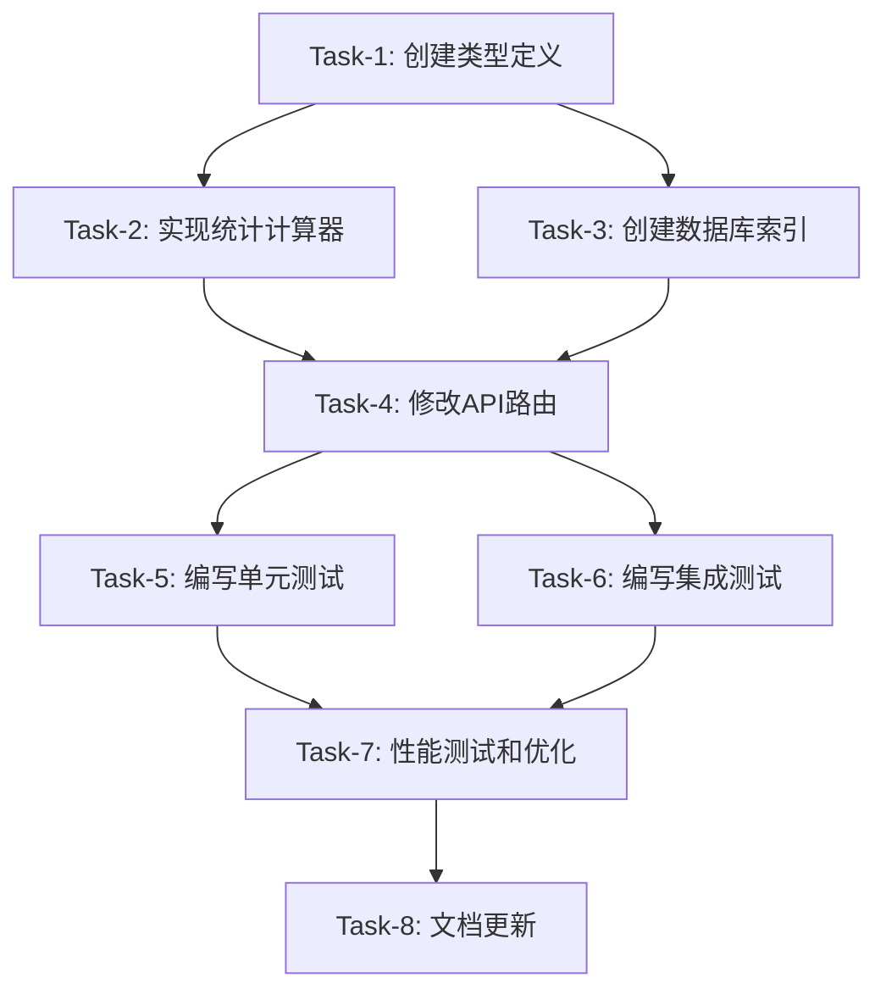

# 采购订单列表接口 Statistics 字段实现任务拆分

## 任务依赖关系图

## 原子任务详细定义

### Task-1: 创建类型定义文件

**任务ID**: `create-types`  
**预估时间**: 30分钟  
**复杂度**: 简单  
**依赖**: 无

#### 输入契约
- **前置依赖**: 架构设计文档已完成
- **输入数据**: DESIGN_purchase_orders_statistics.md 中的类型定义
- **环境依赖**: TypeScript 开发环境

#### 实现约束
- **技术栈**: TypeScript
- **文件位置**: `/src/types/purchase-statistics.ts`
- **接口规范**: 严格按照设计文档中的接口定义
- **质量要求**: 所有类型必须有 JSDoc 注释

#### 输出契约
- **输出数据**: 完整的 TypeScript 类型定义文件
- **交付物**: 
  - `PurchaseOrderStatistics` 接口
  - `ProductSupplyStatus` 接口
  - `PurchaseOrderQueryFilters` 接口
- **验收标准**: 
  - TypeScript 编译通过
  - 所有接口字段类型正确
  - JSDoc 注释完整

#### 依赖关系
- **后置任务**: Task-2, Task-4
- **并行任务**: Task-3

---

### Task-2: 实现统计计算器类

**任务ID**: `implement-calculator`  
**预估时间**: 2小时  
**复杂度**: 中等  
**依赖**: Task-1

#### 输入契约
- **前置依赖**: Task-1 完成，类型定义可用
- **输入数据**: 
  - Prisma Client 实例
  - 筛选条件参数
- **环境依赖**: 
  - Prisma 数据库连接
  - 现有数据库 schema

#### 实现约束
- **技术栈**: TypeScript + Prisma
- **文件位置**: `/src/lib/purchase-statistics.ts`
- **接口规范**: 实现 `PurchaseOrderStatisticsCalculator` 类
- **质量要求**: 
  - 所有方法必须有错误处理
  - 查询必须使用事务（如需要）
  - 代码覆盖率 ≥ 80%

#### 输出契约
- **输出数据**: 完整的统计计算器类
- **交付物**: 
  - `PurchaseOrderStatisticsCalculator` 类
  - `calculateStatistics` 主方法
  - `buildWhereCondition` 私有方法
  - `calculateBasicStatistics` 私有方法
  - `calculateProductStatistics` 私有方法
  - `getPurchaseOrderIds` 私有方法
  - `getSuppliedQuantity` 私有方法
- **验收标准**: 
  - 所有方法实现完整
  - 错误处理机制完善
  - 查询逻辑正确
  - 性能优化（并行查询）

#### 依赖关系
- **前置任务**: Task-1
- **后置任务**: Task-4, Task-5
- **并行任务**: Task-3

---

### Task-3: 创建数据库索引

**任务ID**: `create-indexes`  
**预估时间**: 30分钟  
**复杂度**: 简单  
**依赖**: 无

#### 输入契约
- **前置依赖**: 数据库 schema 分析完成
- **输入数据**: 现有数据库表结构
- **环境依赖**: 
  - 数据库管理权限
  - Prisma 迁移工具

#### 实现约束
- **技术栈**: Prisma Migration
- **文件位置**: 新的 migration 文件
- **接口规范**: 遵循 Prisma 迁移规范
- **质量要求**: 
  - 索引创建不影响现有数据
  - 提供回滚方案

#### 输出契约
- **输出数据**: 数据库索引优化
- **交付物**: 
  - `idx_purchase_orders_shop_status` 索引
  - `idx_product_items_related` 索引
  - `idx_supply_records_purchase_status` 索引
  - `idx_supply_record_items_product` 索引
- **验收标准**: 
  - 索引创建成功
  - 查询性能提升验证
  - 不影响现有功能

#### 依赖关系
- **前置任务**: 无
- **后置任务**: Task-4, Task-7
- **并行任务**: Task-1, Task-2

---

### Task-4: 修改API路由实现

**任务ID**: `modify-api-route`  
**预估时间**: 1.5小时  
**复杂度**: 中等  
**依赖**: Task-1, Task-2, Task-3

#### 输入契约
- **前置依赖**: 
  - Task-1: 类型定义完成
  - Task-2: 统计计算器实现完成
  - Task-3: 数据库索引创建完成
- **输入数据**: 
  - 现有 API 路由代码
  - HTTP 请求参数
- **环境依赖**: 
  - Next.js API Routes 环境
  - 数据库连接

#### 实现约束
- **技术栈**: Next.js 14 App Router + TypeScript
- **文件位置**: `/src/app/api/v1/purchase-orders/route.ts`
- **接口规范**: 
  - 保持现有 API 行为不变
  - 新增 statistics 字段到响应中
- **质量要求**: 
  - 向后兼容性
  - 错误处理完善
  - 响应时间不超过现有接口 50%

#### 输出契约
- **输出数据**: 增强的 API 响应
- **交付物**: 
  - 修改后的 GET 方法实现
  - 统计计算器集成代码
  - 错误处理逻辑
  - 响应格式更新
- **验收标准**: 
  - API 功能完整
  - 统计数据准确
  - 现有功能不受影响
  - 错误情况处理正确

#### 依赖关系
- **前置任务**: Task-1, Task-2, Task-3
- **后置任务**: Task-5, Task-6
- **并行任务**: 无

---

### Task-5: 编写单元测试

**任务ID**: `write-unit-tests`  
**预估时间**: 2小时  
**复杂度**: 中等  
**依赖**: Task-2, Task-4

#### 输入契约
- **前置依赖**: 
  - Task-2: 统计计算器实现完成
  - Task-4: API 路由修改完成
- **输入数据**: 
  - 实现的业务逻辑代码
  - 测试数据集
- **环境依赖**: 
  - Jest 测试框架
  - 测试数据库

#### 实现约束
- **技术栈**: Jest + TypeScript
- **文件位置**: 
  - `/src/lib/__tests__/purchase-statistics.test.ts`
  - `/src/app/api/v1/purchase-orders/__tests__/route.test.ts`
- **接口规范**: 遵循项目测试规范
- **质量要求**: 
  - 代码覆盖率 ≥ 80%
  - 测试用例覆盖所有分支
  - Mock 外部依赖

#### 输出契约
- **输出数据**: 完整的单元测试套件
- **交付物**: 
  - `PurchaseOrderStatisticsCalculator` 测试
  - API 路由测试
  - 边界条件测试
  - 异常情况测试
- **验收标准**: 
  - 所有测试通过
  - 覆盖率达标
  - 测试执行时间合理

#### 依赖关系
- **前置任务**: Task-2, Task-4
- **后置任务**: Task-7
- **并行任务**: Task-6

---

### Task-6: 编写集成测试

**任务ID**: `write-integration-tests`  
**预估时间**: 1.5小时  
**复杂度**: 中等  
**依赖**: Task-4

#### 输入契约
- **前置依赖**: Task-4 API 路由修改完成
- **输入数据**: 
  - 完整的 API 实现
  - 测试数据库
- **环境依赖**: 
  - 测试环境数据库
  - HTTP 测试工具

#### 实现约束
- **技术栈**: Jest + Supertest
- **文件位置**: `/src/app/api/v1/purchase-orders/__tests__/integration.test.ts`
- **接口规范**: 测试完整的 HTTP 请求响应流程
- **质量要求**: 
  - 测试真实数据库交互
  - 覆盖不同筛选条件组合
  - 验证数据一致性

#### 输出契约
- **输出数据**: 集成测试套件
- **交付物**: 
  - API 端到端测试
  - 不同筛选条件测试
  - 数据一致性验证
  - 性能基准测试
- **验收标准**: 
  - 所有集成测试通过
  - 数据准确性验证
  - 响应格式正确

#### 依赖关系
- **前置任务**: Task-4
- **后置任务**: Task-7
- **并行任务**: Task-5

---

### Task-7: 性能测试和优化

**任务ID**: `performance-optimization`  
**预估时间**: 1小时  
**复杂度**: 中等  
**依赖**: Task-5, Task-6

#### 输入契约
- **前置依赖**: 
  - Task-5: 单元测试完成
  - Task-6: 集成测试完成
- **输入数据**: 
  - 完整实现的功能
  - 性能测试数据集
- **环境依赖**: 
  - 性能测试工具
  - 生产级数据量

#### 实现约束
- **技术栈**: Jest + 性能监控工具
- **文件位置**: `/src/app/api/v1/purchase-orders/__tests__/performance.test.ts`
- **接口规范**: 性能指标符合设计要求
- **质量要求**: 
  - 响应时间 ≤ 2秒
  - 并发处理能力验证
  - 内存使用合理

#### 输出契约
- **输出数据**: 性能测试报告和优化建议
- **交付物**: 
  - 性能测试用例
  - 性能基准报告
  - 优化建议文档
  - 监控指标定义
- **验收标准**: 
  - 性能指标达标
  - 优化措施有效
  - 监控机制完善

#### 依赖关系
- **前置任务**: Task-5, Task-6
- **后置任务**: Task-8
- **并行任务**: 无

---

### Task-8: 文档更新和交付

**任务ID**: `update-documentation`  
**预估时间**: 45分钟  
**复杂度**: 简单  
**依赖**: Task-7

#### 输入契约
- **前置依赖**: 所有功能实现和测试完成
- **输入数据**: 
  - 完整的实现代码
  - 测试结果报告
- **环境依赖**: 文档编写工具

#### 实现约束
- **技术栈**: Markdown
- **文件位置**: 
  - API 文档更新
  - README 更新
  - 部署文档更新
- **接口规范**: 遵循项目文档规范
- **质量要求**: 
  - 文档准确完整
  - 示例代码可执行
  - 部署步骤清晰

#### 输出契约
- **输出数据**: 完整的项目文档
- **交付物**: 
  - API 接口文档更新
  - 使用示例和说明
  - 部署和配置指南
  - 故障排除指南
- **验收标准**: 
  - 文档内容准确
  - 示例可执行
  - 部署步骤验证

#### 依赖关系
- **前置任务**: Task-7
- **后置任务**: 无
- **并行任务**: 无

## 任务执行计划

### 第一阶段：基础准备（并行执行）
- **Task-1**: 创建类型定义 (30分钟)
- **Task-3**: 创建数据库索引 (30分钟)

### 第二阶段：核心实现
- **Task-2**: 实现统计计算器 (2小时) - 依赖 Task-1

### 第三阶段：API集成
- **Task-4**: 修改API路由 (1.5小时) - 依赖 Task-1, Task-2, Task-3

### 第四阶段：测试验证（并行执行）
- **Task-5**: 单元测试 (2小时) - 依赖 Task-2, Task-4
- **Task-6**: 集成测试 (1.5小时) - 依赖 Task-4

### 第五阶段：优化完善
- **Task-7**: 性能测试和优化 (1小时) - 依赖 Task-5, Task-6

### 第六阶段：文档交付
- **Task-8**: 文档更新 (45分钟) - 依赖 Task-7

## 总体时间估算

- **总工作量**: 约 9.5 小时
- **关键路径**: Task-1 → Task-2 → Task-4 → Task-5 → Task-7 → Task-8
- **并行优化后**: 约 7.5 小时

## 风险评估

### 高风险任务
- **Task-2**: 统计计算器实现 - 业务逻辑复杂，查询性能要求高
- **Task-4**: API路由修改 - 需要保证向后兼容性

### 风险缓解措施
- 提前进行数据库查询性能测试
- 实现渐进式部署策略
- 准备回滚方案

### 质量检查点
- 每个任务完成后立即进行验收
- 关键任务需要 Code Review
- 集成测试必须在真实环境中验证

## 验收标准总览

### 功能完整性
- ✅ statistics 字段正确返回
- ✅ 所有统计数据准确
- ✅ 筛选条件正确应用
- ✅ 现有功能不受影响

### 性能要求
- ✅ API 响应时间 ≤ 2秒
- ✅ 数据库查询优化
- ✅ 并发处理能力

### 质量标准
- ✅ 代码覆盖率 ≥ 80%
- ✅ 所有测试通过
- ✅ 文档完整准确
- ✅ 错误处理完善

### 部署就绪
- ✅ 数据库迁移脚本
- ✅ 配置文件更新
- ✅ 监控指标定义
- ✅ 回滚方案准备