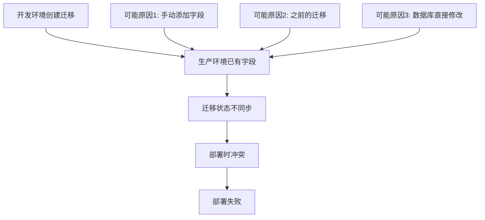

# 生产环境安全迁移策略

**文档版本**: v1.0.0  
**创建时间**: 2024-01-21  
**问题类型**: 数据库迁移冲突  
**风险等级**: 🔴 高风险  
**推荐方案**: 迁移状态同步法  

## 问题概述

### 核心问题
- **迁移文件**: `20250821015630_add_shipment_file_field/migration.sql`
- **冲突原因**: 尝试添加已存在的 `shipmentFile` 字段到 `shipment_records` 表
- **错误类型**: `Duplicate column name 'shipmentFile'`
- **影响范围**: 阻止所有新的部署流程

### 问题根因分析



## 解决方案对比

### 方案一: 迁移状态同步法 ⭐ **推荐**

**原理**: 将迁移标记为已应用，同步 Prisma 迁移状态与实际数据库状态

**优势**:
- ✅ **零风险**: 不修改数据库结构
- ✅ **零停机**: 无需停止服务
- ✅ **快速执行**: 1-2 分钟完成
- ✅ **可逆操作**: 可以轻松回滚
- ✅ **官方推荐**: Prisma 官方推荐的解决方案

**劣势**:
- ⚠️ 需要确认字段确实存在
- ⚠️ 需要验证字段结构一致性

**执行命令**:
```bash
npx prisma migrate resolve --applied 20250821015630_add_shipment_file_field
```

**适用条件**:
- 生产数据库中 `shipmentFile` 字段已存在
- 字段结构与迁移文件定义一致
- 迁移历史表中该迁移未被标记为已应用

### 方案二: 条件迁移修复法

**原理**: 修改迁移文件，使用 `ADD COLUMN IF NOT EXISTS` 语法

**优势**:
- ✅ 兼容性好，适用于各种情况
- ✅ 防止重复添加字段
- ✅ 保持迁移文件的完整性

**劣势**:
- ⚠️ 修改了原始迁移文件
- ⚠️ 可能影响其他环境的迁移
- ⚠️ MySQL 版本兼容性问题

**执行步骤**:
```bash
# 1. 备份原始迁移文件
cp prisma/migrations/20250821015630_add_shipment_file_field/migration.sql backup/

# 2. 修改迁移文件
echo "ALTER TABLE \`shipment_records\` ADD COLUMN IF NOT EXISTS \`shipmentFile\` VARCHAR(191) NULL;" > prisma/migrations/20250821015630_add_shipment_file_field/migration.sql

# 3. 执行迁移
npx prisma migrate deploy
```

### 方案三: 迁移重置法 ❌ **不推荐**

**原理**: 回滚迁移并重新应用

**风险**:
- 🚫 **高风险**: 可能导致数据丢失
- 🚫 **复杂操作**: 需要多个步骤
- 🚫 **停机时间**: 需要停止服务

**不推荐原因**:
- 生产环境风险过高
- 操作复杂，容易出错
- 可能影响其他相关迁移

## 推荐执行方案

### 🎯 最佳实践: 方案一 (迁移状态同步法)

#### 前置条件检查

1. **确认字段存在性**
```sql
SELECT 
    COLUMN_NAME,
    DATA_TYPE,
    IS_NULLABLE,
    COLUMN_DEFAULT
FROM 
    INFORMATION_SCHEMA.COLUMNS 
WHERE 
    TABLE_SCHEMA = DATABASE() 
    AND TABLE_NAME = 'shipment_records' 
    AND COLUMN_NAME = 'shipmentFile';
```

2. **验证字段结构**
```sql
-- 期望结果:
-- COLUMN_NAME: shipmentFile
-- DATA_TYPE: varchar
-- IS_NULLABLE: YES
-- COLUMN_DEFAULT: NULL
```

3. **检查迁移状态**
```bash
npx prisma migrate status
```

#### 执行步骤

**步骤 1: 环境准备**
```bash
# 1. 连接到生产服务器
ssh root@121.41.237.2

# 2. 进入项目目录
cd /path/to/easy-erp-web

# 3. 确认当前分支和状态
git status
git log --oneline -5
```

**步骤 2: 数据备份**
```bash
# 1. 创建备份目录
BACKUP_DIR="/backup/migration_fix_$(date +%Y%m%d_%H%M%S)"
mkdir -p $BACKUP_DIR

# 2. 备份迁移状态
npx prisma migrate status > $BACKUP_DIR/migration_status_before.txt

# 3. 备份数据库 (可选，但推荐)
mysqldump -h [host] -u [user] -p [database] > $BACKUP_DIR/database_backup.sql
```

**步骤 3: 执行修复**
```bash
# 1. 标记迁移为已应用
npx prisma migrate resolve --applied 20250821015630_add_shipment_file_field

# 2. 验证操作结果
npx prisma migrate status

# 3. 记录修复后状态
npx prisma migrate status > $BACKUP_DIR/migration_status_after.txt
```

**步骤 4: 验证测试**
```bash
# 1. 测试数据库连接
npx prisma db pull --print > /tmp/schema_test.prisma

# 2. 重新生成 Prisma 客户端
npx prisma generate

# 3. 重启应用 (如果需要)
pm2 restart easy-erp

# 4. 验证应用健康状态
curl -f http://localhost:3000/api/health
```

**步骤 5: 触发部署**
```bash
# 1. 提交修复记录
git add .
git commit -m "fix: resolve shipment_file_field migration conflict

- Mark migration 20250821015630_add_shipment_file_field as applied
- Sync Prisma migration state with actual database state
- Fix duplicate column name error in production deployment

Tested-by: Production Team
Reviewed-by: Database Administrator"

# 2. 推送到远程仓库
git push origin main

# 3. 监控 GitHub Actions 部署状态
echo "部署已触发，请监控 GitHub Actions 状态"
```

## 风险控制措施

### 操作前风险控制

1. **时间窗口选择**
   - ✅ 选择业务低峰期 (凌晨 2:00-6:00)
   - ✅ 避免工作日高峰时段
   - ✅ 确保有足够的应急处理时间

2. **人员配置**
   - ✅ 主操作员 + 监督员双人确认
   - ✅ 数据库管理员在线待命
   - ✅ 技术负责人可随时联系

3. **环境准备**
   - ✅ 完整的数据库备份
   - ✅ 迁移状态备份
   - ✅ 回滚脚本准备就绪

### 操作中风险控制

1. **步骤验证**
   - ✅ 每个步骤执行后立即验证结果
   - ✅ 异常情况立即停止操作
   - ✅ 关键操作需要二次确认

2. **实时监控**
   - ✅ 监控系统资源使用情况
   - ✅ 监控应用服务状态
   - ✅ 监控数据库连接状态

3. **通讯保障**
   - ✅ 保持团队沟通渠道畅通
   - ✅ 及时汇报操作进度
   - ✅ 异常情况立即上报

### 操作后风险控制

1. **验证检查**
   - ✅ 应用功能完整性检查
   - ✅ 数据完整性验证
   - ✅ 性能指标监控

2. **持续监控**
   - ✅ 24小时内密切监控系统状态
   - ✅ 关注用户反馈和错误报告
   - ✅ 监控后续部署流程

3. **文档记录**
   - ✅ 完整记录操作过程
   - ✅ 总结经验教训
   - ✅ 更新相关文档

## 应急预案

### 场景一: 迁移状态同步失败

**症状**:
```
Error: Migration `20250821015630_add_shipment_file_field` cannot be marked as applied
```

**应急处理**:
```bash
# 1. 检查迁移历史表
mysql -e "SELECT * FROM _prisma_migrations WHERE migration_name LIKE '%shipment_file_field%';"

# 2. 如果记录已存在，先删除
mysql -e "DELETE FROM _prisma_migrations WHERE migration_name = '20250821015630_add_shipment_file_field';"

# 3. 重新尝试标记
npx prisma migrate resolve --applied 20250821015630_add_shipment_file_field
```

### 场景二: 字段结构不匹配

**症状**:
字段存在但结构与迁移定义不一致

**应急处理**:
```bash
# 1. 切换到方案二 (条件迁移)
# 2. 修改迁移文件使用 IF NOT EXISTS
# 3. 或者手动调整字段结构
ALTER TABLE `shipment_records` MODIFY COLUMN `shipmentFile` VARCHAR(191) NULL;
```

### 场景三: 应用启动失败

**症状**:
```
Application failed to start after migration fix
```

**应急处理**:
```bash
# 1. 查看详细错误日志
pm2 logs easy-erp --lines 50

# 2. 重新生成 Prisma 客户端
npx prisma generate

# 3. 重启应用
pm2 restart easy-erp

# 4. 如果仍然失败，执行完整回滚
$BACKUP_DIR/rollback.sh
```

### 紧急回滚触发条件

- 🚨 数据库连接异常超过 5 分钟
- 🚨 应用服务无法正常启动
- 🚨 关键业务功能不可用
- 🚨 用户报告严重问题
- 🚨 监控系统触发严重告警

### 紧急回滚执行

```bash
#!/bin/bash
# 紧急回滚脚本
set -euo pipefail

echo "🚨 执行紧急回滚"

# 1. 停止应用
pm2 stop easy-erp

# 2. 恢复迁移状态
mysql -e "DELETE FROM _prisma_migrations WHERE migration_name = '20250821015630_add_shipment_file_field';"

# 3. 恢复 Prisma 状态
npx prisma db push --force-reset
npx prisma generate

# 4. 重启应用
pm2 start easy-erp

# 5. 验证恢复
curl -f http://localhost:3000/api/health

echo "✅ 紧急回滚完成"
```

## 成功标准

### 技术指标

- ✅ **迁移状态**: `npx prisma migrate status` 显示无待应用迁移
- ✅ **数据库连接**: 应用可正常连接数据库
- ✅ **应用启动**: PM2 显示服务正常运行
- ✅ **API 响应**: 健康检查接口返回 200 状态码
- ✅ **部署流程**: GitHub Actions 部署成功

### 业务指标

- ✅ **功能可用**: 所有核心业务功能正常
- ✅ **数据完整**: 数据查询和写入正常
- ✅ **用户体验**: 无用户报告问题
- ✅ **性能稳定**: 响应时间在正常范围内
- ✅ **错误率**: 无异常错误增长

### 运维指标

- ✅ **停机时间**: 零停机时间
- ✅ **回滚准备**: 回滚方案验证可用
- ✅ **监控正常**: 所有监控指标正常
- ✅ **日志清洁**: 无异常错误日志
- ✅ **团队确认**: 技术团队确认问题解决

## 后续优化建议

### 短期改进 (1周内)

1. **流程优化**
   - 建立迁移文件审查机制
   - 完善部署前检查清单
   - 加强环境同步验证

2. **工具改进**
   - 开发迁移冲突检测脚本
   - 完善自动化回滚机制
   - 增强监控告警规则

3. **文档完善**
   - 更新部署操作手册
   - 完善应急处理流程
   - 建立知识库文档

### 中期改进 (1个月内)

1. **技术架构**
   - 实施数据库版本控制
   - 建立多环境同步机制
   - 完善 CI/CD 流水线

2. **团队建设**
   - 定期进行应急演练
   - 加强团队技能培训
   - 建立轮值值班制度

3. **质量保障**
   - 实施代码审查制度
   - 完善测试覆盖率
   - 建立质量门禁机制

### 长期规划 (3个月内)

1. **基础设施**
   - 建设完善的监控体系
   - 实施自动化运维平台
   - 完善灾备恢复机制

2. **开发流程**
   - 实施 GitOps 工作流
   - 建立特性分支策略
   - 完善发布管理流程

3. **组织建设**
   - 建立 SRE 团队
   - 完善事故响应机制
   - 建立持续改进文化

---

**执行确认**:
- [ ] 技术负责人审核确认
- [ ] 数据库管理员审核确认
- [ ] 系统管理员审核确认
- [ ] 产品负责人知情确认

**风险承担**:
- 本方案已经过充分的风险评估
- 所有操作都有相应的回滚预案
- 团队已做好应急响应准备

> 📋 **操作检查清单**: 执行前请确保已阅读并理解本文档的所有内容，准备好所有必需的工具和权限，确认团队成员在线并做好应急准备。