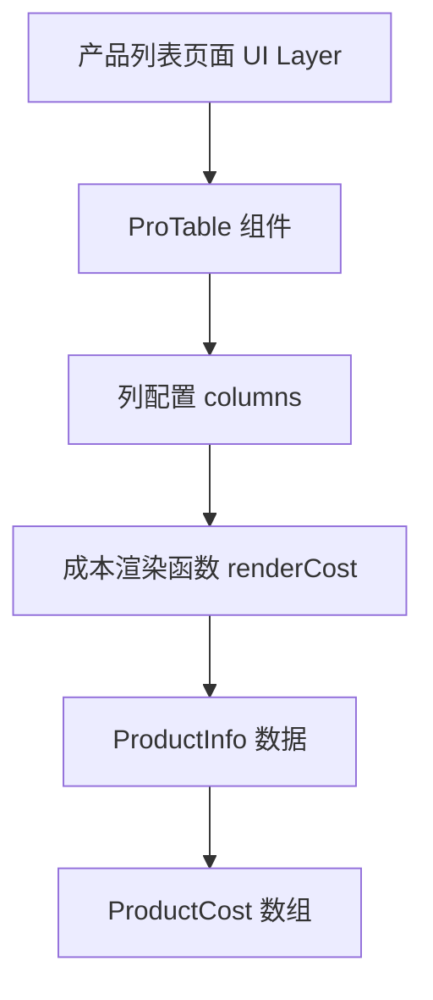
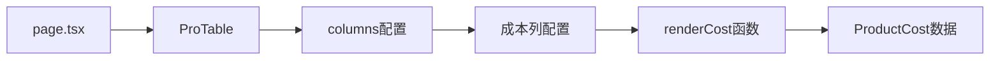
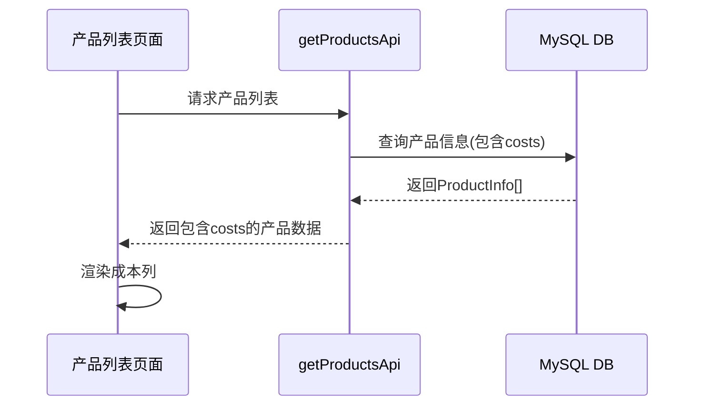

# 产品成本字段增加 - 架构设计文档

## 1. 整体架构设计

### 系统分层


### 核心组件关系


## 2. 数据流设计

### 数据获取流程


### 数据结构映射
```typescript
// 输入数据结构
interface ProductInfo {
  specification?: string;  // 规格字段
  costs?: ProductCost[];   // 成本数组
}

// 成本数据结构
interface ProductCost {
  costInfo?: string;    // 成本信息描述
  price?: string;       // 价格
  unit?: string;        // 单位
  supplier?: string;    // 供应商
  createdAt: string;    // 创建时间
}

// 输出显示格式
type CostDisplay = string; // "价格 单位" | "成本信息" | "-"
```

## 3. 成本显示逻辑设计

### 显示优先级策略
```typescript
/**
 * 成本显示优先级：
 * 1. 优先显示最新的成本记录（按createdAt降序）
 * 2. 价格+单位 > 成本信息 > 空值显示
 * 3. 格式："价格 单位" 或 "成本信息" 或 "-"
 */
function getCostDisplay(costs?: ProductCost[]): string {
  if (!costs || costs.length === 0) {
    return '-';
  }
  
  // 获取最新的成本记录
  const latestCost = costs.sort((a, b) => 
    new Date(b.createdAt).getTime() - new Date(a.createdAt).getTime()
  )[0];
  
  // 优先显示价格+单位
  if (latestCost.price && latestCost.unit) {
    return `${latestCost.price} ${latestCost.unit}`;
  }
  
  // 其次显示价格（无单位）
  if (latestCost.price) {
    return latestCost.price;
  }
  
  // 再次显示成本信息
  if (latestCost.costInfo) {
    return latestCost.costInfo;
  }
  
  return '-';
}
```

### 渲染函数设计
```typescript
const renderCost = (costs: ProductCost[] | undefined) => {
  const display = getCostDisplay(costs);
  
  return (
    <span 
      className="text-sm"
      title={costs && costs.length > 1 ? `共${costs.length}条成本记录` : undefined}
    >
      {display}
    </span>
  );
};
```

## 4. 列配置设计

### 成本列配置
```typescript
const costColumn = {
  title: '成本',
  dataIndex: 'costs',
  key: 'costs',
  width: 120,
  render: (costs: ProductCost[] | undefined) => renderCost(costs),
  sorter: false, // 暂不支持排序
};
```

### 列插入位置策略
```typescript
// 在规格列后插入成本列
function insertCostColumn(columns: any[]) {
  const specIndex = columns.findIndex(col => col.dataIndex === 'specification');
  if (specIndex !== -1) {
    columns.splice(specIndex + 1, 0, costColumn);
  } else {
    // 如果找不到规格列，插入到倒数第二位（操作列之前）
    columns.splice(-1, 0, costColumn);
  }
  return columns;
}
```

## 5. 接口契约定义

### 输入契约
- **数据源**: `ProductInfo[]` 来自 `getProductsApi()`
- **成本字段**: `costs?: ProductCost[]`
- **依赖**: 现有的 ProTable 组件和列配置

### 输出契约
- **显示格式**: 字符串类型的成本信息
- **列宽**: 120px
- **对齐方式**: 左对齐
- **空值处理**: 显示 "-"

### 异常处理策略
```typescript
// 异常情况处理
function safeRenderCost(costs: any) {
  try {
    if (!Array.isArray(costs)) {
      return '-';
    }
    return getCostDisplay(costs);
  } catch (error) {
    console.warn('成本渲染异常:', error);
    return '-';
  }
}
```

## 6. 性能优化设计

### 渲染优化
```typescript
// 使用 useMemo 缓存成本显示计算
const memoizedRenderCost = useMemo(() => {
  return (costs: ProductCost[] | undefined) => {
    return renderCost(costs);
  };
}, []);
```

### 数据处理优化
- 成本排序在渲染时进行，避免影响原始数据
- 使用简单的字符串拼接，避免复杂的格式化
- 异常处理确保不会因为数据问题导致页面崩溃

## 7. 扩展性设计

### 未来扩展点
1. **成本排序**: 可以添加按成本排序功能
2. **成本筛选**: 可以添加成本范围筛选
3. **成本详情**: 点击成本可以查看详细信息
4. **多成本显示**: 可以显示所有成本记录

### 配置化设计
```typescript
// 成本显示配置
interface CostDisplayConfig {
  showMultiple?: boolean;    // 是否显示多个成本
  format?: 'price-unit' | 'cost-info' | 'auto'; // 显示格式
  sortBy?: 'createdAt' | 'price'; // 排序方式
  emptyText?: string;        // 空值显示文本
}
```

## 8. 质量保证

### 类型安全
- 所有函数都有明确的 TypeScript 类型定义
- 使用类型守卫确保数据安全
- 接口定义完整且一致

### 错误处理
- 数据异常不会导致页面崩溃
- 提供友好的错误提示
- 日志记录便于调试

### 测试策略
```typescript
// 测试用例设计
describe('成本显示功能', () => {
  test('正常显示价格+单位', () => {});
  test('显示成本信息', () => {});
  test('空数据显示-', () => {});
  test('多成本显示最新', () => {});
  test('异常数据处理', () => {});
});
```

## 9. 实施计划

### 开发步骤
1. **步骤1**: 实现成本显示逻辑函数
2. **步骤2**: 创建成本列配置
3. **步骤3**: 修改 columns 数组，插入成本列
4. **步骤4**: 测试各种数据情况
5. **步骤5**: 优化样式和用户体验

### 验证检查点
- [ ] 成本列正确显示在规格列后
- [ ] 各种数据情况正确处理
- [ ] 性能无明显影响
- [ ] TypeScript 编译通过
- [ ] 代码风格符合规范

---

**设计状态**: 架构设计完成  
**创建时间**: 2025-01-15  
**设计者**: AI Assistant  
**审核状态**: 待审核