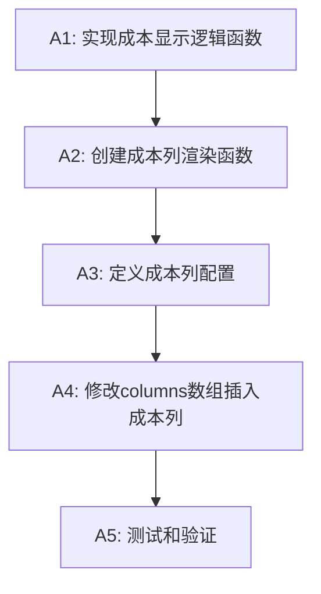

# 产品成本字段增加 - 任务分解文档

## 1. 任务概述

**目标**: 在产品列表页面的规格字段后面添加成本字段显示
**范围**: `/src/app/products/products/page.tsx` 文件修改
**预估时间**: 45分钟

## 2. 原子任务分解

### 任务 A1: 实现成本显示逻辑函数

**输入契约**:
- ProductCost[] 类型的成本数组
- 可能为 undefined 或空数组

**处理步骤**:
1. 创建 `getCostDisplay` 函数
2. 实现成本数据排序逻辑（按创建时间降序）
3. 实现显示优先级逻辑（价格+单位 > 价格 > 成本信息 > 空值）
4. 添加异常处理

**输出契约**:
- 返回格式化的成本显示字符串
- 空值返回 "-"
- 异常情况返回 "-"

**验收标准**:
- [ ] 函数正确处理各种输入情况
- [ ] 返回值格式符合预期
- [ ] 异常处理完善
- [ ] TypeScript 类型检查通过

**代码实现**:
```typescript
const getCostDisplay = (costs?: ProductCost[]): string => {
  if (!costs || costs.length === 0) {
    return '-';
  }
  
  try {
    // 获取最新的成本记录
    const latestCost = costs.sort((a, b) => 
      new Date(b.createdAt).getTime() - new Date(a.createdAt).getTime()
    )[0];
    
    // 优先显示价格+单位
    if (latestCost.price && latestCost.unit) {
      return `${latestCost.price} ${latestCost.unit}`;
    }
    
    // 其次显示价格（无单位）
    if (latestCost.price) {
      return latestCost.price;
    }
    
    // 再次显示成本信息
    if (latestCost.costInfo) {
      return latestCost.costInfo;
    }
    
    return '-';
  } catch (error) {
    console.warn('成本显示计算异常:', error);
    return '-';
  }
};
```

**依赖关系**: 无
**预估时间**: 15分钟

---

### 任务 A2: 创建成本列渲染函数

**输入契约**:
- ProductCost[] | undefined 类型的成本数据
- 来自 ProTable 的 render 函数参数

**处理步骤**:
1. 创建 `renderCost` 函数
2. 调用 `getCostDisplay` 获取显示文本
3. 返回 JSX 元素
4. 添加 tooltip 提示（多成本情况）

**输出契约**:
- 返回 React JSX 元素
- 包含适当的样式类名
- 多成本时显示提示信息

**验收标准**:
- [ ] 渲染函数正确返回 JSX
- [ ] 样式类名正确应用
- [ ] tooltip 功能正常
- [ ] 多成本提示准确

**代码实现**:
```typescript
const renderCost = (costs: ProductCost[] | undefined) => {
  const display = getCostDisplay(costs);
  const hasMultipleCosts = costs && costs.length > 1;
  
  return (
    <span 
      className="text-sm text-gray-700"
      title={hasMultipleCosts ? `共${costs.length}条成本记录，显示最新记录` : undefined}
    >
      {display}
    </span>
  );
};
```

**依赖关系**: 依赖任务 A1
**预估时间**: 10分钟

---

### 任务 A3: 定义成本列配置

**输入契约**:
- ProTable columns 配置规范
- 成本列的显示要求

**处理步骤**:
1. 创建成本列配置对象
2. 设置列标题、dataIndex、key
3. 设置列宽和渲染函数
4. 配置排序和筛选选项

**输出契约**:
- 符合 ProTable 规范的列配置对象
- 包含完整的列属性

**验收标准**:
- [ ] 列配置格式正确
- [ ] 属性设置合理
- [ ] 与其他列风格一致

**代码实现**:
```typescript
const costColumn = {
  title: '成本',
  dataIndex: 'costs',
  key: 'costs',
  width: 120,
  render: renderCost,
  sorter: false,
  align: 'left' as const,
};
```

**依赖关系**: 依赖任务 A2
**预估时间**: 5分钟

---

### 任务 A4: 修改 columns 数组插入成本列

**输入契约**:
- 现有的 columns 数组
- 规格列的位置信息

**处理步骤**:
1. 找到规格列在 columns 数组中的索引
2. 在规格列后插入成本列配置
3. 处理找不到规格列的异常情况
4. 确保数组操作不影响其他列

**输出契约**:
- 修改后的 columns 数组
- 成本列位置正确
- 其他列顺序不变

**验收标准**:
- [ ] 成本列插入位置正确
- [ ] 其他列不受影响
- [ ] 异常情况处理得当
- [ ] 数组操作安全

**代码实现**:
```typescript
// 在现有 columns 数组中找到规格列位置并插入成本列
const columns = [
  // ... 现有列配置
  {
    title: '规格',
    dataIndex: 'specification',
    key: 'specification',
    width: 120,
    render: (text: string) => text || '-',
  },
  // 在此处插入成本列
  costColumn,
  // ... 其他列配置
];
```

**依赖关系**: 依赖任务 A3
**预估时间**: 10分钟

---

### 任务 A5: 测试和验证

**输入契约**:
- 修改后的产品列表页面
- 各种测试数据场景

**处理步骤**:
1. 本地启动开发服务器
2. 访问产品列表页面
3. 验证成本列显示正确
4. 测试各种数据情况
5. 检查控制台错误

**输出契约**:
- 功能正常运行
- 无控制台错误
- 各种数据情况正确处理

**验收标准**:
- [ ] 成本列正确显示在规格列后
- [ ] 有成本数据的产品正确显示
- [ ] 无成本数据的产品显示 "-"
- [ ] 多成本数据显示最新记录
- [ ] 页面性能无明显影响
- [ ] 无 JavaScript 错误

**测试用例**:
1. **正常成本数据**: 产品有价格和单位
2. **仅价格数据**: 产品只有价格没有单位
3. **仅成本信息**: 产品只有 costInfo
4. **多成本记录**: 产品有多条成本记录
5. **空成本数据**: 产品没有成本记录
6. **异常数据**: 成本数据格式异常

**依赖关系**: 依赖任务 A4
**预估时间**: 15分钟

## 3. 任务依赖关系图



## 4. 风险评估

### 技术风险
- **低风险**: 仅添加显示列，不修改数据结构
- **低风险**: 使用现有 API 和数据
- **低风险**: 改动范围小且明确

### 业务风险
- **低风险**: 不影响现有功能
- **低风险**: 纯显示功能，无数据修改

### 性能风险
- **低风险**: 成本数据已在现有 API 中返回
- **低风险**: 渲染逻辑简单，性能影响微小

## 5. 回滚计划

如果出现问题，可以通过以下步骤快速回滚：
1. 从 columns 数组中移除成本列配置
2. 删除相关的渲染函数
3. 重新部署代码

## 6. 质量保证

### 代码质量
- TypeScript 类型检查
- ESLint 代码规范检查
- Prettier 代码格式化

### 功能质量
- 手动测试各种数据场景
- 检查浏览器兼容性
- 验证响应式布局

### 性能质量
- 检查渲染性能
- 验证内存使用
- 测试大数据量情况

---

**任务状态**: 任务分解完成  
**创建时间**: 2025-01-15  
**预估总时间**: 45分钟  
**风险等级**: 低风险