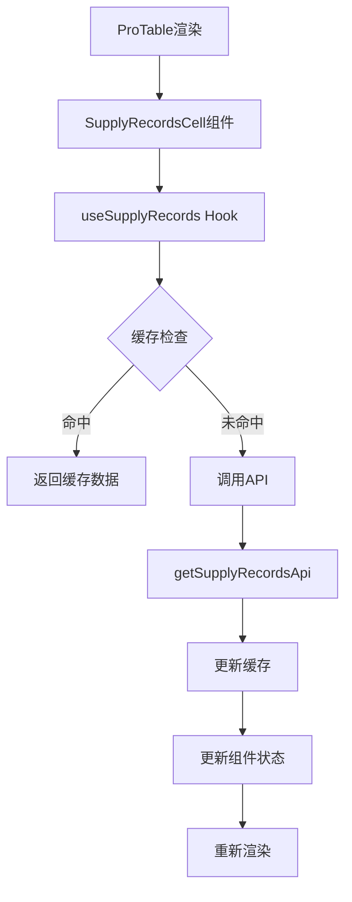

# ARCHITECTURE - 供货记录API集成优化

## 架构设计概览 (Architecture Overview)

### 设计原则
1. **异步优先**: 采用异步加载策略，不阻塞主界面渲染
2. **缓存机制**: 实现智能缓存，提升性能和用户体验
3. **状态管理**: 统一的加载、成功、失败状态管理
4. **类型安全**: 完整的TypeScript类型定义
5. **可扩展性**: 支持未来功能扩展和优化

### 核心架构模式
- **Hook-based State Management**: 使用自定义Hook管理供货记录状态
- **Service Layer Pattern**: API调用层与UI层分离
- **Cache-First Strategy**: 优先使用缓存数据，异步更新
- **Error Boundary Pattern**: 完善的错误处理和降级策略

## 技术架构设计 (Technical Architecture)

### 1. 数据流架构



### 2. 组件架构设计

#### 2.1 SupplyRecordsCell 组件
```typescript
interface SupplyRecordsCellProps {
  purchaseOrderId: string;
  fallbackCount?: number;
  onClick?: (records: SupplyRecord[]) => void;
}

const SupplyRecordsCell: React.FC<SupplyRecordsCellProps> = ({
  purchaseOrderId,
  fallbackCount = 0,
  onClick
}) => {
  const { data, loading, error } = useSupplyRecords(purchaseOrderId);
  
  const displayCount = data?.statistics.totalRecords ?? fallbackCount;
  
  return (
    <Button
      type="link"
      size="small"
      loading={loading}
      onClick={() => onClick?.(data?.records || [])}
      style={{ padding: 0 }}
    >
      {error ? (
        <Tooltip title={`加载失败: ${error.message}`}>
          <span style={{ color: '#ff4d4f' }}>加载失败</span>
        </Tooltip>
      ) : (
        <span style={{ color: '#1890ff' }}>
          共{displayCount}条
        </span>
      )}
    </Button>
  );
};
```

#### 2.2 useSupplyRecords Hook
```typescript
interface UseSupplyRecordsResult {
  data: SupplyRecordsResponse | null;
  loading: boolean;
  error: Error | null;
  refetch: () => Promise<void>;
}

const useSupplyRecords = (purchaseOrderId: string): UseSupplyRecordsResult => {
  const [data, setData] = useState<SupplyRecordsResponse | null>(null);
  const [loading, setLoading] = useState(false);
  const [error, setError] = useState<Error | null>(null);
  
  const fetchData = useCallback(async () => {
    // 缓存检查
    const cached = supplyRecordsCache.get(purchaseOrderId);
    if (cached && !supplyRecordsCache.isExpired(purchaseOrderId)) {
      setData(cached);
      return;
    }
    
    setLoading(true);
    setError(null);
    
    try {
      const response = await getSupplyRecordsApi(purchaseOrderId);
      setData(response.data);
      supplyRecordsCache.set(purchaseOrderId, response.data);
    } catch (err) {
      setError(err as Error);
    } finally {
      setLoading(false);
    }
  }, [purchaseOrderId]);
  
  useEffect(() => {
    fetchData();
  }, [fetchData]);
  
  return { data, loading, error, refetch: fetchData };
};
```

### 3. 缓存架构设计

#### 3.1 缓存策略
```typescript
class SupplyRecordsCache {
  private cache = new Map<string, CacheItem<SupplyRecordsResponse>>();
  private readonly TTL = 5 * 60 * 1000; // 5分钟缓存
  
  set(key: string, data: SupplyRecordsResponse): void {
    this.cache.set(key, {
      data,
      timestamp: Date.now(),
      ttl: this.TTL
    });
  }
  
  get(key: string): SupplyRecordsResponse | null {
    const item = this.cache.get(key);
    if (!item || this.isExpired(key)) {
      this.cache.delete(key);
      return null;
    }
    return item.data;
  }
  
  isExpired(key: string): boolean {
    const item = this.cache.get(key);
    if (!item) return true;
    return Date.now() - item.timestamp > item.ttl;
  }
  
  clear(): void {
    this.cache.clear();
  }
  
  // 预加载策略
  preload(purchaseOrderIds: string[]): void {
    purchaseOrderIds.forEach(id => {
      if (!this.get(id)) {
        // 异步预加载，不阻塞主流程
        getSupplyRecordsApi(id)
          .then(response => this.set(id, response.data))
          .catch(() => {}); // 静默失败
      }
    });
  }
}

const supplyRecordsCache = new SupplyRecordsCache();
```

#### 3.2 缓存接口定义
```typescript
interface CacheItem<T> {
  data: T;
  timestamp: number;
  ttl: number;
}

interface SupplyRecordsResponse {
  statistics: SupplyStatistics;
  records: SupplyRecord[];
  orderInfo: {
    id: string;
    orderNumber: string;
    totalAmount: string;
    status: string;
  };
}
```

### 4. 性能优化架构

#### 4.1 请求去重机制
```typescript
class RequestDeduplicator {
  private pendingRequests = new Map<string, Promise<any>>();
  
  async dedupe<T>(key: string, requestFn: () => Promise<T>): Promise<T> {
    if (this.pendingRequests.has(key)) {
      return this.pendingRequests.get(key) as Promise<T>;
    }
    
    const promise = requestFn().finally(() => {
      this.pendingRequests.delete(key);
    });
    
    this.pendingRequests.set(key, promise);
    return promise;
  }
}

const requestDeduplicator = new RequestDeduplicator();
```

#### 4.2 批量加载策略
```typescript
class BatchLoader {
  private queue: string[] = [];
  private timer: NodeJS.Timeout | null = null;
  private readonly BATCH_SIZE = 10;
  private readonly DELAY = 100; // 100ms延迟批量处理
  
  add(purchaseOrderId: string): void {
    if (!this.queue.includes(purchaseOrderId)) {
      this.queue.push(purchaseOrderId);
    }
    
    if (this.timer) {
      clearTimeout(this.timer);
    }
    
    this.timer = setTimeout(() => {
      this.processBatch();
    }, this.DELAY);
  }
  
  private async processBatch(): void {
    const batch = this.queue.splice(0, this.BATCH_SIZE);
    
    // 并发请求，但限制并发数
    const promises = batch.map(id => 
      requestDeduplicator.dedupe(
        `supply-records-${id}`,
        () => getSupplyRecordsApi(id)
      )
    );
    
    try {
      const results = await Promise.allSettled(promises);
      results.forEach((result, index) => {
        if (result.status === 'fulfilled') {
          supplyRecordsCache.set(batch[index], result.value.data);
        }
      });
    } catch (error) {
      console.error('Batch loading failed:', error);
    }
    
    // 如果还有待处理的请求，继续处理
    if (this.queue.length > 0) {
      this.timer = setTimeout(() => {
        this.processBatch();
      }, this.DELAY);
    }
  }
}

const batchLoader = new BatchLoader();
```

## 集成架构设计 (Integration Architecture)

### 1. 表格列定义更新
```typescript
{
  title: '供货记录',
  width: 100,
  align: 'center',
  render: (_, record) => (
    <SupplyRecordsCell
      purchaseOrderId={record.id}
      fallbackCount={record.items?.length ?? 0}
      onClick={(records) => handleSupplyRecords(record, records)}
    />
  ),
}
```

### 2. 预加载集成
```typescript
// 在ProTable的数据加载完成后触发预加载
const handleTableDataLoad = (data: PurchaseOrder[]) => {
  const purchaseOrderIds = data.map(order => order.id);
  supplyRecordsCache.preload(purchaseOrderIds);
};
```

### 3. 错误处理集成
```typescript
const ErrorBoundary: React.FC<{ children: React.ReactNode }> = ({ children }) => {
  return (
    <ErrorBoundaryComponent
      fallback={<span style={{ color: '#ff4d4f' }}>加载失败</span>}
    >
      {children}
    </ErrorBoundaryComponent>
  );
};
```

## 监控和日志架构 (Monitoring & Logging)

### 1. 性能监控
```typescript
class PerformanceMonitor {
  static trackApiCall(purchaseOrderId: string, duration: number, success: boolean) {
    // 记录API调用性能
    console.log(`Supply Records API [${purchaseOrderId}]: ${duration}ms, Success: ${success}`);
  }
  
  static trackCacheHit(purchaseOrderId: string, hit: boolean) {
    // 记录缓存命中率
    console.log(`Cache [${purchaseOrderId}]: ${hit ? 'HIT' : 'MISS'}`);
  }
}
```

### 2. 错误日志
```typescript
class ErrorLogger {
  static logApiError(purchaseOrderId: string, error: Error) {
    console.error(`Supply Records API Error [${purchaseOrderId}]:`, error);
    // 可以集成到错误监控系统
  }
}
```

## 部署和配置 (Deployment & Configuration)

### 1. 环境配置
```typescript
const config = {
  cache: {
    ttl: process.env.SUPPLY_RECORDS_CACHE_TTL || 5 * 60 * 1000,
    maxSize: process.env.SUPPLY_RECORDS_CACHE_MAX_SIZE || 1000
  },
  api: {
    timeout: process.env.SUPPLY_RECORDS_API_TIMEOUT || 10000,
    retries: process.env.SUPPLY_RECORDS_API_RETRIES || 3
  },
  batch: {
    size: process.env.SUPPLY_RECORDS_BATCH_SIZE || 10,
    delay: process.env.SUPPLY_RECORDS_BATCH_DELAY || 100
  }
};
```

### 2. 特性开关
```typescript
const featureFlags = {
  enableAsyncSupplyRecords: true,
  enableBatchLoading: true,
  enablePreloading: true,
  enableCaching: true
};
```

---

**文档版本**: v1.0  
**创建时间**: 2025-01-07  
**负责人**: AI Assistant  
**状态**: 设计完成