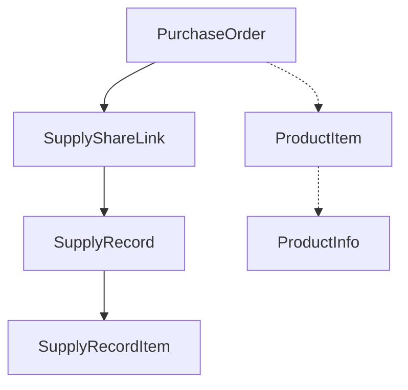

# DESIGN - 供货记录接口修复

## 问题根因分析

通过数据库调试，发现了问题的根本原因：

### 调试结果
1. ✅ 采购订单存在：`cmdvbqu5d0079zeo6av75tvri` (CGDD20250803000003)
2. ❌ **分享链接不存在**：该采购订单没有对应的分享链接
3. ❌ **供货记录为空**：因为没有分享链接，所以没有供货记录
4. ✅ 其他采购订单有供货记录：其他订单通过分享链接正常创建了供货记录

### 数据模型依赖关系


**关键发现**：
- `SupplyRecord` 必须有 `shareCode` 字段
- `shareCode` 来自 `SupplyShareLink` 表
- **没有分享链接 = 没有供货记录**

## 系统架构分析

### 当前API实现
```typescript
// /api/v1/purchase-orders/[id]/supply-records/route.ts
const supplyRecords = await prisma.supplyRecord.findMany({
  where: { purchaseOrderId }, // 直接按采购订单ID查询
  // ...
});
```

### 问题分析
当前API实现逻辑正确，但数据层面存在问题：
1. 采购订单创建后，没有自动创建分享链接
2. 没有分享链接，就无法创建供货记录
3. API返回空数组是正确的，因为确实没有数据

## 解决方案设计

### 方案一：修复数据创建流程（推荐）

**目标**：确保采购订单创建时自动创建分享链接

#### 1. 分享链接自动创建
```typescript
// 在采购订单创建/审批时自动创建分享链接
async function createSupplyShareLink(purchaseOrderId: string) {
  const shareCode = generateShareCode(); // 生成唯一分享码
  const expiresAt = new Date();
  expiresAt.setMonth(expiresAt.getMonth() + 6); // 6个月有效期
  
  return await prisma.supplyShareLink.create({
    data: {
      purchaseOrderId,
      shareCode,
      expiresAt,
      status: 'active'
    }
  });
}
```

#### 2. 修复现有数据
为已存在但没有分享链接的采购订单补充分享链接

### 方案二：API兼容性增强（备选）

**目标**：API能够处理没有分享链接的情况

#### 1. 智能分享链接创建
```typescript
// API中检测并自动创建分享链接
if (!shareLink) {
  shareLink = await createSupplyShareLink(purchaseOrderId);
}
```

#### 2. 返回更友好的信息
```typescript
// 当没有供货记录时，返回提示信息
if (supplyRecords.length === 0) {
  return ApiResponseHelper.success({
    statistics,
    records: [],
    orderInfo,
    message: '暂无供货记录，请先创建分享链接'
  });
}
```

## 推荐实施方案

### 采用方案一：修复数据创建流程

**理由**：
1. 从根本上解决问题
2. 保持数据一致性
3. 符合业务逻辑
4. 避免API层面的复杂处理

### 实施步骤

#### 阶段1：数据修复
1. 为现有采购订单补充分享链接
2. 验证数据完整性

#### 阶段2：流程修复
1. 修改采购订单创建/审批流程
2. 确保自动创建分享链接

#### 阶段3：验证测试
1. 测试API返回正确数据
2. 验证新创建的采购订单流程

## 技术实现细节

### 分享码生成算法
```typescript
function generateShareCode(): string {
  const chars = 'ABCDEFGHJKMNPQRSTUVWXYZabcdefghijkmnpqrstuvwxyz23456789';
  let result = '';
  for (let i = 0; i < 16; i++) {
    result += chars.charAt(Math.floor(Math.random() * chars.length));
  }
  return result;
}
```

### 数据库迁移脚本
```sql
-- 为现有采购订单创建分享链接
INSERT INTO supply_share_links (id, purchaseOrderId, shareCode, expiresAt, status, createdAt, updatedAt)
SELECT 
  CONCAT('share_', id) as id,
  id as purchaseOrderId,
  CONCAT('AUTO_', SUBSTRING(MD5(CONCAT(id, NOW())), 1, 12)) as shareCode,
  DATE_ADD(NOW(), INTERVAL 6 MONTH) as expiresAt,
  'active' as status,
  NOW() as createdAt,
  NOW() as updatedAt
FROM purchase_orders 
WHERE id NOT IN (SELECT purchaseOrderId FROM supply_share_links);
```

## 质量保证

### 验证标准
1. 所有采购订单都有对应的分享链接
2. API能够正确返回供货记录（即使为空）
3. 新创建的采购订单自动生成分享链接
4. 分享链接的唯一性和有效性

### 测试用例
1. 测试现有采购订单的API调用
2. 测试新创建采购订单的完整流程
3. 测试分享链接的创建和使用
4. 测试供货记录的创建流程