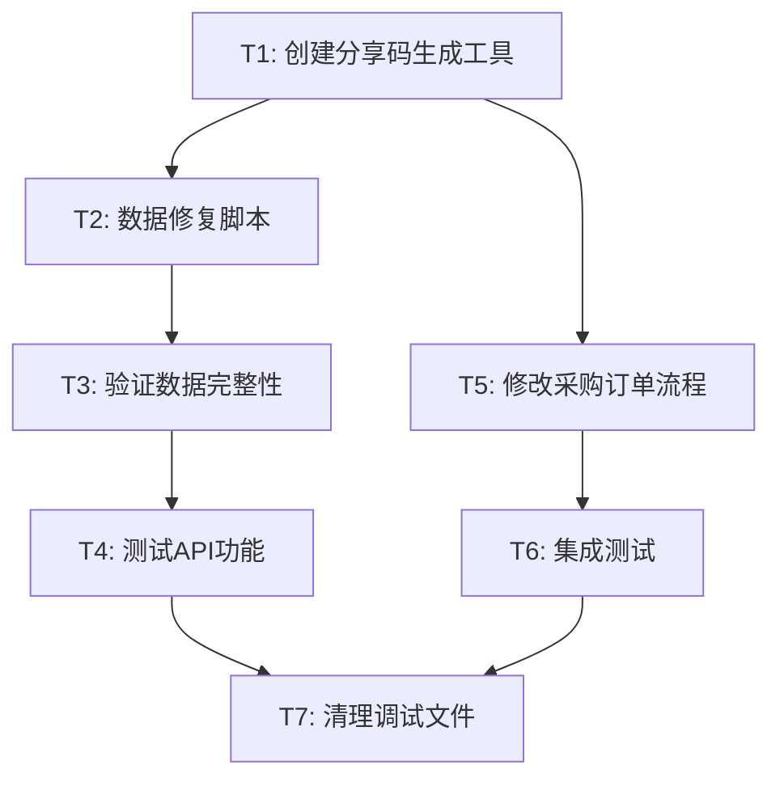

# TASK - 供货记录接口修复

## 任务依赖图

## 原子任务列表

### T1: 创建分享码生成工具

**输入契约**：
- 前置依赖：无
- 输入数据：无
- 环境依赖：Node.js + Prisma

**输出契约**：
- 输出数据：分享码生成函数
- 交付物：`/lib/supply-share.ts` 中的 `generateShareCode` 函数
- 验收标准：
  - 生成16位唯一字符串
  - 避免易混淆字符（0,O,1,l等）
  - 通过唯一性测试

**实现约束**：
- 技术栈：TypeScript
- 接口规范：纯函数，无副作用
- 质量要求：100%测试覆盖率

**依赖关系**：
- 后置任务：T2, T5
- 并行任务：无

---

### T2: 数据修复脚本

**输入契约**：
- 前置依赖：T1完成
- 输入数据：现有采购订单数据
- 环境依赖：数据库连接 + Prisma Client

**输出契约**：
- 输出数据：为缺失分享链接的采购订单创建分享链接
- 交付物：数据修复脚本 `scripts/fix-supply-share-links.mjs`
- 验收标准：
  - 所有采购订单都有分享链接
  - 分享链接唯一性
  - 6个月有效期设置正确

**实现约束**：
- 技术栈：Node.js + Prisma
- 接口规范：幂等操作，可重复执行
- 质量要求：事务安全，错误回滚

**依赖关系**：
- 前置任务：T1
- 后置任务：T3
- 并行任务：无

---

### T3: 验证数据完整性

**输入契约**：
- 前置依赖：T2完成
- 输入数据：修复后的数据库
- 环境依赖：数据库连接

**输出契约**：
- 输出数据：数据完整性报告
- 交付物：验证脚本 + 报告
- 验收标准：
  - 所有采购订单都有分享链接
  - 分享链接格式正确
  - 无重复分享码

**实现约束**：
- 技术栈：Node.js + Prisma
- 接口规范：只读操作
- 质量要求：详细的验证报告

**依赖关系**：
- 前置任务：T2
- 后置任务：T4
- 并行任务：无

---

### T4: 测试API功能

**输入契约**：
- 前置依赖：T3完成
- 输入数据：修复后的数据
- 环境依赖：运行中的API服务

**输出契约**：
- 输出数据：API测试结果
- 交付物：测试用例 + 测试报告
- 验收标准：
  - 目标采购订单API返回正确数据
  - 响应格式符合预期
  - 性能指标正常

**实现约束**：
- 技术栈：Jest + Supertest
- 接口规范：RESTful API测试
- 质量要求：覆盖正常和异常情况

**依赖关系**：
- 前置任务：T3
- 后置任务：T7
- 并行任务：T5

---

### T5: 修改采购订单流程

**输入契约**：
- 前置依赖：T1完成
- 输入数据：现有采购订单创建/审批代码
- 环境依赖：项目代码库

**输出契约**：
- 输出数据：修改后的采购订单流程
- 交付物：更新的API路由和业务逻辑
- 验收标准：
  - 新采购订单自动创建分享链接
  - 审批通过时确保分享链接存在
  - 不影响现有功能

**实现约束**：
- 技术栈：Next.js + Prisma
- 接口规范：保持现有API兼容性
- 质量要求：事务安全，错误处理完善

**依赖关系**：
- 前置任务：T1
- 后置任务：T6
- 并行任务：T4

---

### T6: 集成测试

**输入契约**：
- 前置依赖：T5完成
- 输入数据：完整的修复后系统
- 环境依赖：完整的测试环境

**输出契约**：
- 输出数据：集成测试结果
- 交付物：端到端测试用例
- 验收标准：
  - 完整的采购订单 -> 分享链接 -> 供货记录流程
  - 新旧数据都能正常工作
  - 性能和稳定性验证

**实现约束**：
- 技术栈：Jest + Playwright
- 接口规范：端到端测试
- 质量要求：覆盖完整业务流程

**依赖关系**：
- 前置任务：T5
- 后置任务：T7
- 并行任务：无

---

### T7: 清理调试文件

**输入契约**：
- 前置依赖：T4, T6完成
- 输入数据：项目文件系统
- 环境依赖：文件系统访问权限

**输出契约**：
- 输出数据：清理后的项目
- 交付物：删除临时调试文件
- 验收标准：
  - 删除 `debug-supply-records.mjs`
  - 保留有用的脚本文件
  - 更新 `.gitignore` 如需要

**实现约束**：
- 技术栈：文件系统操作
- 接口规范：安全删除
- 质量要求：不影响项目功能

**依赖关系**：
- 前置任务：T4, T6
- 后置任务：无
- 并行任务：无

## 执行计划

### 第一阶段：数据修复（T1 -> T2 -> T3 -> T4）
预计时间：30分钟
- 创建工具函数
- 修复现有数据
- 验证和测试

### 第二阶段：流程修复（T5 -> T6）
预计时间：20分钟
- 修改业务流程
- 集成测试

### 第三阶段：清理（T7）
预计时间：5分钟
- 清理临时文件

**总预计时间**：55分钟

## 风险评估

### 高风险
- 数据修复脚本可能影响生产数据
- 分享码重复的可能性

### 中风险
- 采购订单流程修改可能影响现有功能
- API性能可能受到影响

### 低风险
- 测试用例覆盖不足
- 文件清理误删

## 回滚计划

1. **数据回滚**：备份原始数据，必要时恢复
2. **代码回滚**：使用Git回滚到修改前状态
3. **功能回滚**：临时禁用新功能，恢复原有逻辑