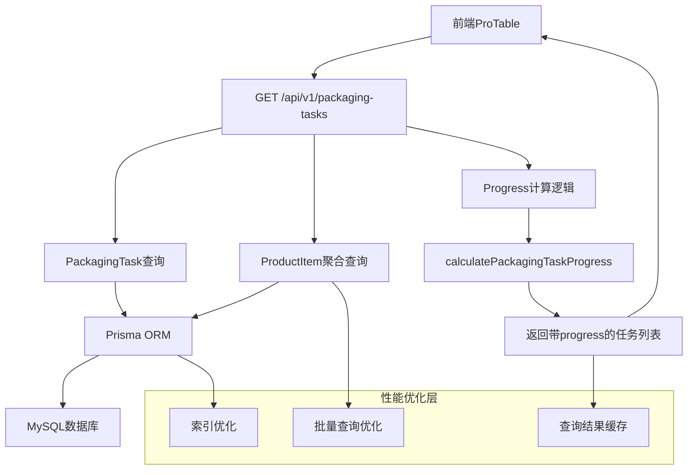
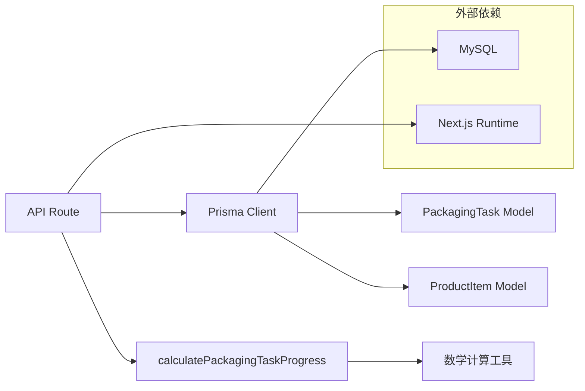
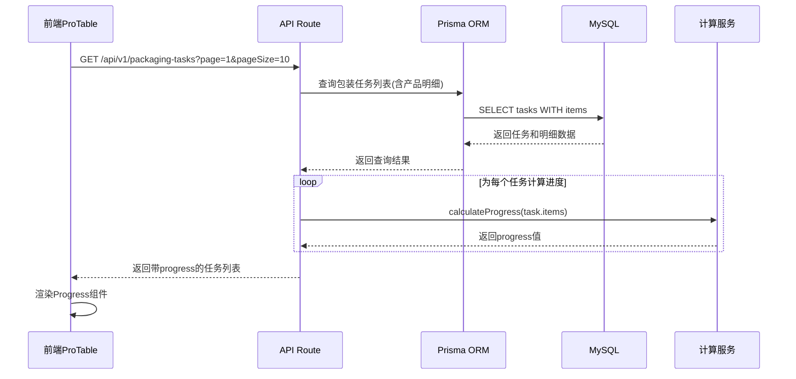

# DESIGN_包装任务进度实时计算

## 整体架构设计

### 系统架构图



### 核心组件设计

#### 1. API层 (route.ts)
- **职责**: 接收请求，协调数据查询和计算
- **输入**: 查询参数 (分页、筛选条件)
- **输出**: 包含实时progress的任务列表
- **关键逻辑**: 批量查询 + 实时计算

#### 2. 数据访问层 (Prisma)
- **职责**: 高效查询包装任务和产品明细
- **优化策略**: 使用include关联查询，避免N+1问题
- **索引策略**: 在关联字段上添加复合索引

#### 3. 计算服务层 (calculatePackagingTaskProgress)
- **职责**: 基于产品明细计算任务进度
- **输入**: ProductItem数组
- **输出**: 进度百分比 (保留2位小数)
- **边界处理**: 空明细、异常数据的处理

## 分层设计

### 1. 表现层 (Presentation Layer)
```typescript
// 前端ProTable - 无需修改
// 继续使用record.progress显示进度
{
  title: '包装进度',
  dataIndex: 'progress',
  render: (progress: number) => (
    <Progress 
      percent={progress || 0} 
      status={progress === 100 ? 'success' : 'active'} 
    />
  )
}
```

### 2. 业务逻辑层 (Business Logic Layer)
```typescript
// API Route Handler
export async function GET(request: Request) {
  // 1. 解析查询参数
  // 2. 批量查询包装任务
  // 3. 批量查询关联产品明细
  // 4. 实时计算progress
  // 5. 返回结果
}
```

### 3. 数据访问层 (Data Access Layer)
```typescript
// 优化后的Prisma查询
const tasks = await prisma.packagingTask.findMany({
  include: {
    items: {
      select: {
        quantity: true,
        completedQuantity: true
      }
    }
  },
  // 分页和筛选条件
});
```

### 4. 数据持久层 (Data Persistence Layer)
```sql
-- 建议添加的索引
CREATE INDEX `idx_product_items_packaging_task` 
ON `product_items` (`relatedId`, `relatedType`);

CREATE INDEX `idx_packaging_task_status` 
ON `packaging_tasks` (`status`, `createdAt`);
```

## 模块依赖关系图



## 接口契约定义

### 1. GET API接口

```typescript
// 请求接口
interface GetPackagingTasksRequest {
  page?: number;
  pageSize?: number;
  status?: string;
  keyword?: string;
}

// 响应接口
interface GetPackagingTasksResponse {
  code: number;
  data: {
    list: PackagingTaskWithProgress[];
    total: number;
    page: number;
    pageSize: number;
  };
  msg: string;
}

// 增强的任务接口
interface PackagingTaskWithProgress extends PackagingTaskInfo {
  progress: number; // 实时计算的进度值
  items?: ProductItemInfo[]; // 可选的产品明细
}
```

### 2. 计算服务接口

```typescript
// 计算函数签名
function calculatePackagingTaskProgress(
  items: ProductItemInfo[]
): number {
  // 实现逻辑
}

// 输入数据结构
interface ProductItemInfo {
  quantity: number;
  completedQuantity: number;
}
```

## 数据流向图



## 异常处理策略

### 1. 数据异常处理

```typescript
// 边界情况处理
function safeCalculateProgress(items: ProductItemInfo[]): number {
  try {
    // 空明细处理
    if (!items || items.length === 0) {
      return 0;
    }
    
    // 数据验证
    const validItems = items.filter(item => 
      typeof item.quantity === 'number' && 
      typeof item.completedQuantity === 'number' &&
      item.quantity >= 0 && 
      item.completedQuantity >= 0
    );
    
    if (validItems.length === 0) {
      return 0;
    }
    
    return calculatePackagingTaskProgress(validItems);
  } catch (error) {
    console.error('Progress calculation error:', error);
    return 0; // 默认返回0，确保系统稳定
  }
}
```

### 2. 数据库异常处理

```typescript
// 查询异常处理
try {
  const tasks = await prisma.packagingTask.findMany({
    // 查询配置
  });
} catch (error) {
  console.error('Database query error:', error);
  return Response.json(
    { code: 500, msg: '数据查询失败', data: null },
    { status: 500 }
  );
}
```

## 性能优化策略

### 1. 数据库查询优化

#### 批量查询策略
```typescript
// 优化前：N+1查询问题
for (const task of tasks) {
  const items = await prisma.productItem.findMany({
    where: { relatedId: task.id }
  });
}

// 优化后：单次关联查询
const tasks = await prisma.packagingTask.findMany({
  include: {
    items: {
      select: {
        quantity: true,
        completedQuantity: true
      }
    }
  }
});
```

#### 索引优化建议
```sql
-- 复合索引优化关联查询
CREATE INDEX idx_product_items_related 
ON "ProductItem" ("relatedType", "relatedId");

-- 优化分页查询
CREATE INDEX idx_packaging_task_pagination 
ON "PackagingTask" ("createdAt" DESC, "id");
```

### 2. 内存优化

```typescript
// 只查询计算所需字段
const tasks = await prisma.packagingTask.findMany({
  select: {
    id: true,
    taskNumber: true,
    status: true,
    // 其他必要字段
    items: {
      select: {
        quantity: true,
        completedQuantity: true
      }
    }
  }
});
```

### 3. 缓存策略 (可选)

```typescript
// Redis缓存实现 (如需要)
const cacheKey = `packaging_task_progress_${taskId}`;
const cachedProgress = await redis.get(cacheKey);

if (cachedProgress) {
  return parseFloat(cachedProgress);
}

const progress = calculateProgress(items);
await redis.setex(cacheKey, 300, progress.toString()); // 5分钟缓存

return progress;
```

## 质量保证策略

### 1. 单元测试设计

```typescript
// 计算逻辑测试
describe('calculatePackagingTaskProgress', () => {
  test('正常情况计算', () => {
    const items = [
      { quantity: 100, completedQuantity: 50 },
      { quantity: 200, completedQuantity: 100 }
    ];
    expect(calculatePackagingTaskProgress(items)).toBe(50.00);
  });
  
  test('边界情况处理', () => {
    expect(calculatePackagingTaskProgress([])).toBe(0);
    expect(calculatePackagingTaskProgress(null)).toBe(0);
  });
});
```

### 2. 集成测试设计

```typescript
// API集成测试
describe('GET /api/v1/packaging-tasks', () => {
  test('返回带progress的任务列表', async () => {
    const response = await request(app)
      .get('/api/v1/packaging-tasks')
      .expect(200);
      
    expect(response.body.data.list[0]).toHaveProperty('progress');
    expect(typeof response.body.data.list[0].progress).toBe('number');
  });
});
```

## 部署和监控

### 1. 性能监控指标
- API响应时间
- 数据库查询时间
- 内存使用情况
- 错误率统计

### 2. 日志记录策略
```typescript
// 关键操作日志
console.log(`Calculating progress for ${tasks.length} tasks`);
console.time('progress_calculation');
// 计算逻辑
console.timeEnd('progress_calculation');
```

## 向后兼容性

### 1. 数据库字段保留
- 保留PackagingTask表中的progress字段
- 作为备用数据源，防止计算失败
- 可用于数据对比和验证

### 2. API接口兼容
- 保持响应数据结构不变
- progress字段类型保持为number
- 错误情况下返回合理默认值

## 风险评估和缓解

### 1. 性能风险
- **风险**: 实时计算增加响应时间
- **缓解**: 数据库查询优化 + 索引优化
- **监控**: 设置响应时间告警阈值

### 2. 数据一致性风险
- **风险**: 计算结果与预期不符
- **缓解**: 充分的单元测试 + 边界条件处理
- **验证**: 与现有数据进行对比验证

### 3. 系统稳定性风险
- **风险**: 计算异常导致API失败
- **缓解**: 异常捕获 + 默认值返回
- **恢复**: 降级到数据库存储的progress值