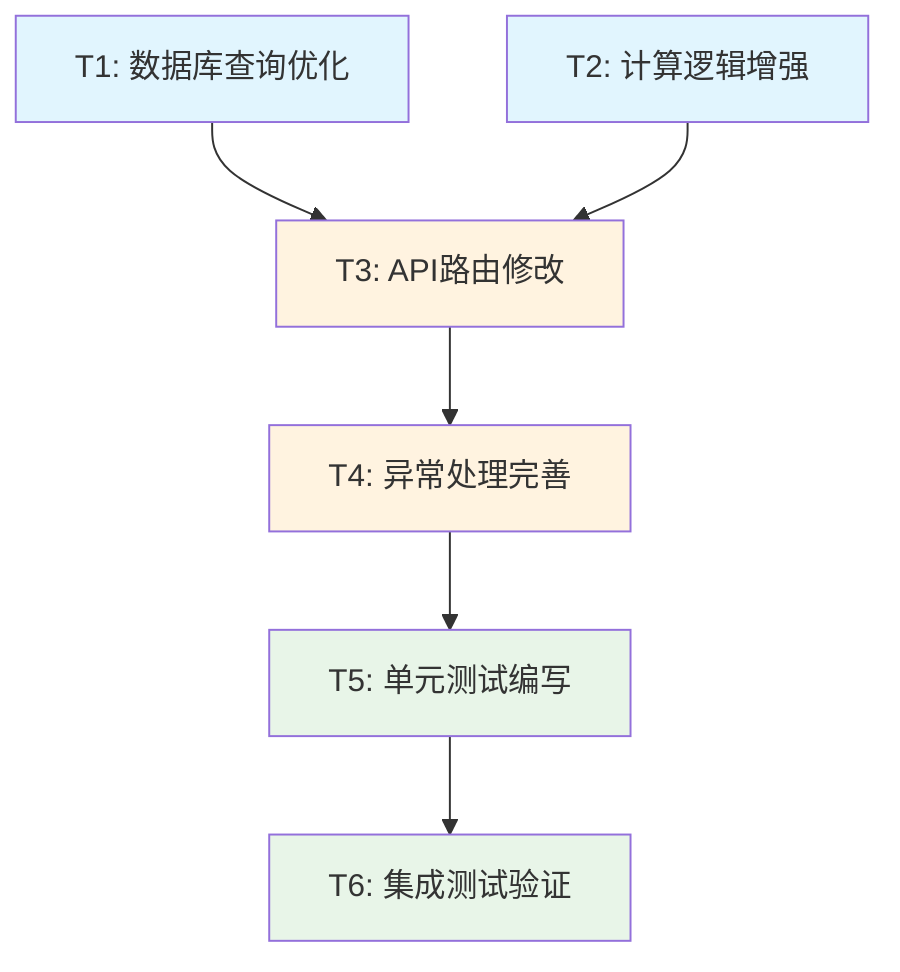

# TASK_包装任务进度实时计算

## 任务拆分概述

基于DESIGN文档，将实时计算progress功能拆分为6个原子任务，每个任务都有明确的输入输出和验收标准。

## 任务依赖关系图

## 原子任务详细定义

### T1: 数据库查询优化

#### 任务描述
优化Prisma查询，使用include关联查询避免N+1问题，并添加必要的数据库索引。

#### 输入契约
- **前置依赖**: 无
- **输入数据**: 现有的Prisma查询代码
- **环境依赖**: 开发环境数据库访问权限

#### 输出契约
- **输出数据**: 优化后的Prisma查询代码
- **交付物**: 
  - 修改后的查询逻辑
  - 数据库索引创建脚本
  - 性能对比测试结果
- **验收标准**: 
  - 查询时间减少50%以上
  - 避免N+1查询问题
  - 支持分页查询优化

#### 实现约束
- **技术栈**: Prisma ORM + MySQL
- **接口规范**: 保持现有查询接口不变
- **质量要求**: 查询性能提升，无功能回归

#### 依赖关系
- **后置任务**: T3 (API路由修改)
- **并行任务**: T2 (计算逻辑增强)

#### 具体实现步骤
1. 分析现有查询性能瓶颈
2. 设计优化的include查询结构
3. 创建必要的数据库索引
4. 编写性能测试用例
5. 验证查询结果正确性

---

### T2: 计算逻辑增强

#### 任务描述
增强calculatePackagingTaskProgress函数，添加边界条件处理和错误处理机制。

#### 输入契约
- **前置依赖**: 无
- **输入数据**: 现有的calculatePackagingTaskProgress函数
- **环境依赖**: TypeScript开发环境

#### 输出契约
- **输出数据**: 增强后的计算函数
- **交付物**:
  - 重构后的计算函数代码
  - 边界条件处理逻辑
  - 函数文档和类型定义
- **验收标准**:
  - 处理空数组、null、undefined输入
  - 处理异常数据（负数、非数字）
  - 保持计算精度（2位小数）
  - 性能不低于原函数

#### 实现约束
- **技术栈**: TypeScript
- **接口规范**: 保持函数签名不变
- **质量要求**: 100%测试覆盖率，无副作用

#### 依赖关系
- **后置任务**: T3 (API路由修改)
- **并行任务**: T1 (数据库查询优化)

#### 具体实现步骤
1. 分析现有函数的边界情况
2. 添加输入参数验证
3. 实现异常数据过滤
4. 优化计算逻辑性能
5. 添加详细的JSDoc文档

---

### T3: API路由修改

#### 任务描述
修改GET /api/v1/packaging-tasks路由，集成优化后的查询和计算逻辑，实现实时progress计算。

#### 输入契约
- **前置依赖**: T1 (数据库查询优化), T2 (计算逻辑增强)
- **输入数据**: 
  - 优化后的Prisma查询
  - 增强后的计算函数
  - 现有的API路由代码
- **环境依赖**: Next.js开发环境

#### 输出契约
- **输出数据**: 修改后的API路由
- **交付物**:
  - 更新后的route.ts文件
  - API响应格式保持不变
  - 实时progress计算逻辑
- **验收标准**:
  - API响应包含准确的progress值
  - 响应时间增加不超过20%
  - 支持现有的分页和筛选功能
  - 向后兼容现有前端代码

#### 实现约束
- **技术栈**: Next.js App Router + TypeScript
- **接口规范**: 保持RESTful API设计
- **质量要求**: 无破坏性变更，性能可接受

#### 依赖关系
- **后置任务**: T4 (异常处理完善)
- **并行任务**: 无

#### 具体实现步骤
1. 集成优化后的数据库查询
2. 在查询结果中添加progress计算
3. 保持原有的响应数据结构
4. 添加性能监控日志
5. 验证API功能完整性

---

### T4: 异常处理完善

#### 任务描述
为API路由添加完善的异常处理机制，确保在各种异常情况下系统的稳定性。

#### 输入契约
- **前置依赖**: T3 (API路由修改)
- **输入数据**: 修改后的API路由代码
- **环境依赖**: 错误监控和日志系统

#### 输出契约
- **输出数据**: 具备完善异常处理的API
- **交付物**:
  - 异常处理中间件
  - 错误日志记录机制
  - 降级策略实现
- **验收标准**:
  - 数据库连接异常时优雅降级
  - 计算异常时返回合理默认值
  - 所有异常都有详细日志记录
  - 用户收到友好的错误信息

#### 实现约束
- **技术栈**: Next.js + 日志库
- **接口规范**: 标准HTTP状态码和错误格式
- **质量要求**: 异常覆盖率100%，用户体验友好

#### 依赖关系
- **后置任务**: T5 (单元测试编写)
- **并行任务**: 无

#### 具体实现步骤
1. 识别所有可能的异常场景
2. 实现分层异常处理策略
3. 添加详细的错误日志
4. 实现降级到数据库progress值
5. 测试各种异常情况的处理

---

### T5: 单元测试编写

#### 任务描述
为所有修改的代码编写全面的单元测试，确保功能正确性和代码质量。

#### 输入契约
- **前置依赖**: T4 (异常处理完善)
- **输入数据**: 所有修改后的代码模块
- **环境依赖**: Jest测试框架 + 测试数据库

#### 输出契约
- **输出数据**: 完整的测试套件
- **交付物**:
  - 计算函数单元测试
  - 数据库查询测试
  - 异常处理测试
  - 测试覆盖率报告
- **验收标准**:
  - 代码覆盖率 ≥ 80%
  - 所有边界条件都有测试用例
  - 异常情况测试覆盖完整
  - 测试执行时间 < 30秒

#### 实现约束
- **技术栈**: Jest + @testing-library
- **接口规范**: 遵循项目测试规范
- **质量要求**: 测试用例清晰，维护性好

#### 依赖关系
- **后置任务**: T6 (集成测试验证)
- **并行任务**: 无

#### 具体实现步骤
1. 为计算函数编写单元测试
2. 为数据库查询编写Mock测试
3. 为异常处理编写测试用例
4. 编写性能基准测试
5. 生成测试覆盖率报告

---

### T6: 集成测试验证

#### 任务描述
编写端到端的集成测试，验证整个功能在真实环境中的表现。

#### 输入契约
- **前置依赖**: T5 (单元测试编写)
- **输入数据**: 完整的功能实现
- **环境依赖**: 测试环境 + 真实数据库

#### 输出契约
- **输出数据**: 集成测试报告
- **交付物**:
  - API集成测试用例
  - 性能测试报告
  - 兼容性验证报告
  - 部署就绪确认
- **验收标准**:
  - API功能测试100%通过
  - 性能指标达到预期
  - 前端兼容性验证通过
  - 生产环境部署就绪

#### 实现约束
- **技术栈**: Supertest + 真实数据库
- **接口规范**: 完整的API测试覆盖
- **质量要求**: 生产级别的质量标准

#### 依赖关系
- **后置任务**: 无 (最终任务)
- **并行任务**: 无

#### 具体实现步骤
1. 搭建集成测试环境
2. 编写API端到端测试
3. 执行性能压力测试
4. 验证前端兼容性
5. 生成最终测试报告

## 任务执行计划

### 时间线安排

| 任务 | 预估时间 | 开始时间 | 结束时间 | 负责人 |
|------|----------|----------|----------|--------|
| T1: 数据库查询优化 | 4小时 | Day 1 AM | Day 1 PM | 后端开发 |
| T2: 计算逻辑增强 | 3小时 | Day 1 AM | Day 1 PM | 后端开发 |
| T3: API路由修改 | 4小时 | Day 1 PM | Day 2 AM | 后端开发 |
| T4: 异常处理完善 | 3小时 | Day 2 AM | Day 2 PM | 后端开发 |
| T5: 单元测试编写 | 4小时 | Day 2 PM | Day 3 AM | 后端开发 |
| T6: 集成测试验证 | 3小时 | Day 3 AM | Day 3 PM | 后端开发 |

### 里程碑设置

- **里程碑1** (Day 1 PM): 核心逻辑完成 (T1, T2)
- **里程碑2** (Day 2 AM): API功能实现 (T3)
- **里程碑3** (Day 2 PM): 异常处理完善 (T4)
- **里程碑4** (Day 3 PM): 测试验证完成 (T5, T6)

## 风险缓解措施

### 技术风险

1. **数据库性能风险**
   - **风险**: 查询优化效果不理想
   - **缓解**: 准备多种优化方案，包括索引和查询结构
   - **应急**: 使用缓存机制作为备选方案

2. **计算精度风险**
   - **风险**: 浮点数计算精度问题
   - **缓解**: 使用固定精度计算，充分测试边界情况
   - **应急**: 保留原有计算逻辑作为备份

3. **API兼容性风险**
   - **风险**: 前端代码需要修改
   - **缓解**: 严格保持API响应格式不变
   - **应急**: 提供兼容性适配层

### 进度风险

1. **开发时间超期**
   - **风险**: 任务复杂度超出预期
   - **缓解**: 任务拆分足够细化，及时调整计划
   - **应急**: 优先保证核心功能，次要功能后续迭代

2. **测试发现重大问题**
   - **风险**: 集成测试发现设计缺陷
   - **缓解**: 早期进行概念验证，分阶段测试
   - **应急**: 回滚到稳定版本，重新设计

## 质量门控

### 代码质量标准
- [ ] TypeScript类型检查通过
- [ ] ESLint规则检查通过
- [ ] Prettier格式化规范
- [ ] 代码review通过

### 功能质量标准
- [ ] 所有单元测试通过
- [ ] 集成测试通过
- [ ] 性能指标达标
- [ ] 异常处理验证通过

### 部署质量标准
- [ ] 生产环境兼容性验证
- [ ] 数据库迁移脚本测试
- [ ] 回滚方案验证
- [ ] 监控告警配置

## 交付清单

### 代码交付物
- [ ] 优化后的Prisma查询代码
- [ ] 增强后的计算函数
- [ ] 修改后的API路由
- [ ] 完善的异常处理机制

### 测试交付物
- [ ] 单元测试套件
- [ ] 集成测试用例
- [ ] 性能测试报告
- [ ] 测试覆盖率报告

### 文档交付物
- [ ] 技术实现文档
- [ ] API接口文档更新
- [ ] 部署指南
- [ ] 运维监控指南

### 配置交付物
- [ ] 数据库索引创建脚本
- [ ] 环境配置更新
- [ ] CI/CD流程配置
- [ ] 监控配置文件