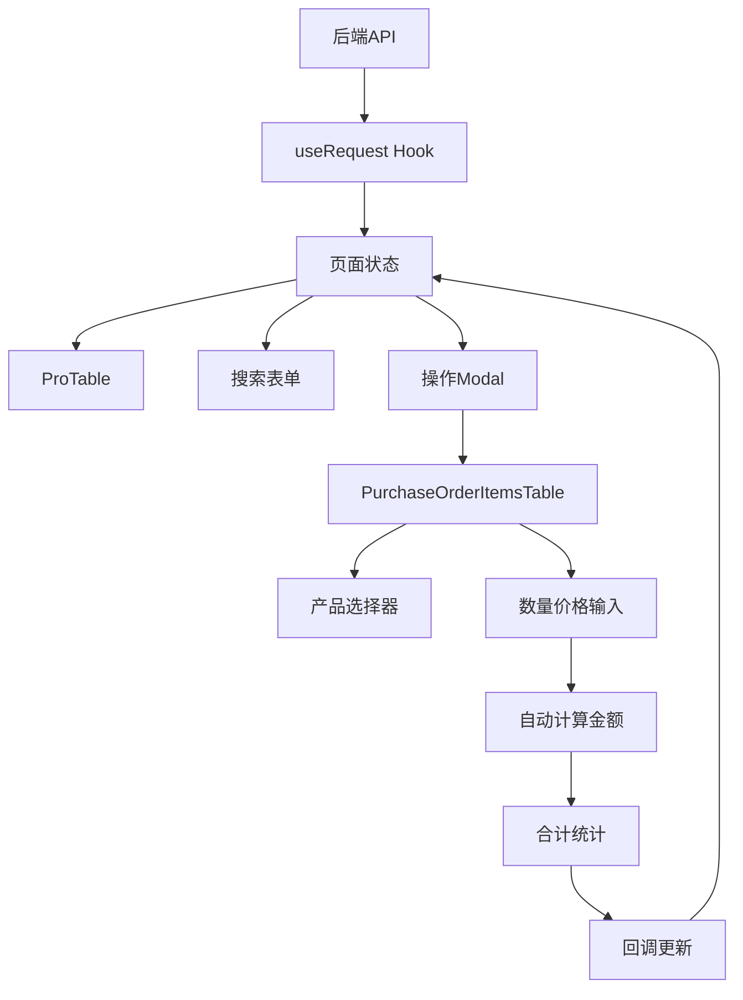

# 采购订单页面分析 - 对齐阶段

## 项目上下文分析

### 技术栈识别
- **前端框架**: Next.js (App Router)
- **UI组件库**: Ant Design + ProComponents
- **状态管理**: React Hooks (useState, useEffect)
- **数据请求**: ahooks useRequest
- **类型系统**: TypeScript
- **样式方案**: CSS Modules + Ant Design 主题

### 架构模式
- **页面结构**: App Router 目录结构 (`src/app/purchase/purchase-orders/`)
- **组件化**: 功能组件拆分 (components 目录)
- **数据流**: Props 向下传递，回调向上通信
- **状态管理**: 本地状态 + 服务端状态分离

### 业务域理解
- **核心业务**: ERP系统中的采购订单管理
- **主要实体**: 采购订单、产品、供应商、店铺、员工
- **业务流程**: 订单创建 → 审批 → 供货 → 完成

## 当前页面功能分析

### 1. 采购订单列表页面 (`page.tsx`)

#### 核心功能模块
1. **数据展示层**
   - ProTable 表格展示采购订单列表
   - 支持分页、排序、筛选
   - 实时数据加载和刷新

2. **搜索筛选层**
   - 店铺筛选 (Select)
   - 供应商筛选 (Select)
   - 订单状态筛选 (Select)
   - 紧急程度筛选 (Select)
   - 操作员筛选 (Select)
   - 日期范围筛选 (DatePicker.RangePicker)

3. **操作功能层**
   - 新增订单 (Modal)
   - 编辑订单 (Modal)
   - 删除订单 (Popconfirm)
   - 订单审批 (Modal)
   - 供应商分享 (Modal)
   - 供货记录管理 (Modal)

4. **状态管理层**
   - 表单状态管理
   - Modal 显示状态
   - 当前操作记录状态
   - 数据加载状态

#### 表格列配置
```typescript
// 主要列字段
- 订单编号 (orderNumber)
- 店铺信息 (shopId -> 店铺名称)
- 供应商信息 (supplierId -> 供应商名称)
- 产品明细 (items -> 产品数量统计)
- 总数量 (totalQuantity)
- 总金额 (totalAmount)
- 供货记录 (deliveryRecords)
- 订单状态 (status)
- 紧急程度 (urgency)
- 操作员 (operatorId)
- 订单时间 (orderDate)
- 操作列 (actions)
```

#### 数据依赖
```typescript
// 外部数据源
- purchaseOrders: 采购订单列表
- shops: 店铺数据
- suppliers: 供应商数据
- products: 产品数据
- employees: 员工数据
```

### 2. 产品明细表格组件 (`purchase-order-items-table.tsx`)

#### 核心功能特性
1. **可编辑表格**
   - 内联编辑模式
   - 实时数据验证
   - 自动计算金额

2. **产品选择器**
   - 下拉搜索选择
   - 产品信息展示 (名称 + 规格)
   - 自动填充成本价格

3. **数量和价格管理**
   - 数量输入 (最小值1，整数)
   - 单价输入 (最小值0，2位小数)
   - 自动计算小计金额

4. **合计计算**
   - 实时计算总数量
   - 实时计算总金额
   - 表格底部合计行
   - 卡片底部合计信息

5. **CRUD操作**
   - 添加产品行
   - 删除产品行 (带确认)
   - 编辑产品信息

#### 数据结构
```typescript
// 产品明细项
interface PurchaseOrderItem {
  key?: string;           // 表格行唯一标识
  productId: string;      // 产品ID
  quantity: number;       // 数量
  unitPrice: number;      // 单价
  amount: number;         // 小计金额
  remark?: string;        // 备注
}

// 产品选项
interface ProductOption {
  id: string;
  code?: string;
  name?: string;
  sku?: string;
  specification?: string;
  category?: { name: string };
  costs?: ProductCost[];  // 成本价格数组
}

// 产品成本
interface ProductCost {
  id: string;
  productId: string;
  costInfo?: string;
  price?: string;         // 成本价格
  unit?: string;
  supplier?: string;
  createdAt: string;
  updatedAt: string;
}
```

#### 组件接口
```typescript
interface PurchaseOrderItemsTableProps {
  items: PurchaseOrderItem[];                    // 产品明细数据
  onChange: (items: PurchaseOrderItem[]) => void; // 数据变更回调
  productsData: ProductOption[];                 // 可选产品数据
  disabled?: boolean;                            // 只读模式
}
```

## 代码质量评估

### 优点
1. **类型安全**: 完整的 TypeScript 类型定义
2. **组件化**: 良好的功能拆分和复用
3. **用户体验**: 丰富的交互反馈和验证
4. **数据一致性**: 实时计算和状态同步
5. **可维护性**: 清晰的代码结构和命名

### 改进空间
1. **性能优化**: 大数据量时的虚拟滚动
2. **错误处理**: 更完善的异常处理机制
3. **可访问性**: ARIA 标签和键盘导航
4. **国际化**: 多语言支持准备
5. **测试覆盖**: 单元测试和集成测试

## 设计模式识别

### 1. 容器-展示组件模式
- `page.tsx`: 容器组件，负责数据获取和状态管理
- `purchase-order-items-table.tsx`: 展示组件，专注UI渲染和交互

### 2. 受控组件模式
- 表单输入完全受控
- 数据流向清晰 (props down, events up)

### 3. 复合组件模式
- Modal + Form + Table 的组合使用
- 功能模块的组合封装

### 4. 状态提升模式
- 共享状态提升到父组件
- 子组件通过回调通信

## 依赖关系分析

### 外部依赖
```json
{
  "antd": "UI组件库",
  "@ant-design/pro-components": "高级表格组件",
  "ahooks": "React Hooks 工具库",
  "react": "核心框架",
  "next.js": "应用框架"
}
```

### 内部依赖
```
page.tsx
├── PurchaseOrderFormModal (采购订单表单)
├── ApprovalModal (审批弹窗)
├── SupplierShareModal (供应商分享)
├── DeliveryRecordsModal (供货记录)
└── PurchaseOrderItemsTable (产品明细表格)
    └── ProductOption[] (产品数据)
```

## 数据流向图



## 业务规则识别

### 1. 数据验证规则
- 产品必选
- 数量 ≥ 1
- 单价 ≥ 0
- 金额自动计算

### 2. 业务流程规则
- 订单状态流转: 待审批 → 已审批 → 已完成
- 权限控制: 不同状态下的操作限制
- 数据完整性: 产品明细不能为空

### 3. UI交互规则
- 编辑模式 vs 只读模式
- 实时反馈和提示
- 确认操作的二次确认

## 总结

这是一个功能完整、结构清晰的采购订单管理系统页面，采用了现代React开发最佳实践，具有良好的用户体验和代码质量。主要特点包括:

1. **功能完整性**: 涵盖CRUD、审批、分享等完整业务流程
2. **技术先进性**: 使用Next.js + TypeScript + Ant Design现代技术栈
3. **用户体验**: 丰富的交互反馈和实时计算
4. **代码质量**: 良好的类型安全和组件化设计
5. **可维护性**: 清晰的代码结构和职责分离

该页面可以作为ERP系统中其他模块的参考实现，展现了企业级应用的标准开发模式。