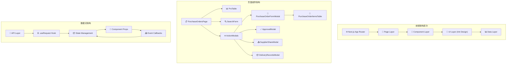
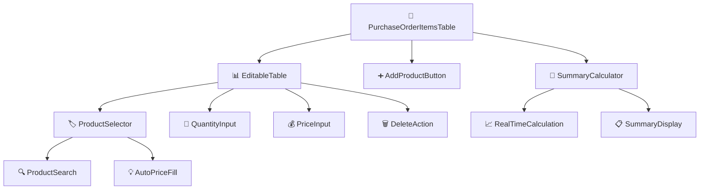
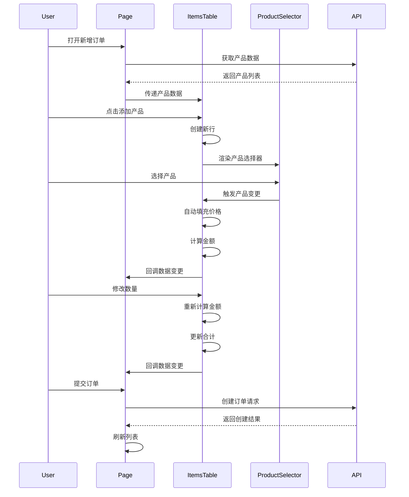

# 采购订单页面分析 - 架构设计阶段

## 整体架构图



## 分层设计详解

### 1. 表现层 (Presentation Layer)

#### 页面容器组件
```typescript
// 📋 PurchaseOrdersPage - 主页面容器
interface PageState {
  // 数据状态
  purchaseOrders: PurchaseOrder[];
  shops: Shop[];
  suppliers: Supplier[];
  products: Product[];
  employees: Employee[];
  
  // UI状态
  loading: boolean;
  searchForm: SearchFormData;
  
  // Modal状态
  formModalVisible: boolean;
  approvalModalVisible: boolean;
  shareModalVisible: boolean;
  deliveryModalVisible: boolean;
  
  // 当前操作记录
  currentRecord: PurchaseOrder | null;
}
```

#### 组件职责分离
```typescript
// 🔍 搜索表单组件
interface SearchFormProps {
  onSearch: (values: SearchFormData) => void;
  onReset: () => void;
  shops: Shop[];
  suppliers: Supplier[];
  employees: Employee[];
}

// 📊 数据表格组件
interface DataTableProps {
  dataSource: PurchaseOrder[];
  loading: boolean;
  onEdit: (record: PurchaseOrder) => void;
  onDelete: (id: string) => void;
  onApproval: (record: PurchaseOrder) => void;
  onShare: (record: PurchaseOrder) => void;
  onDelivery: (record: PurchaseOrder) => void;
}
```

### 2. 业务逻辑层 (Business Logic Layer)

#### 数据处理逻辑
```typescript
// 💼 业务逻辑处理
class PurchaseOrderService {
  // 数据转换
  static transformTableData(orders: PurchaseOrder[]): TableDataItem[] {
    return orders.map(order => ({
      ...order,
      shopName: order.shop?.name || '未知店铺',
      supplierName: order.supplier?.name || '未知供应商',
      operatorName: order.operator?.name || '未知操作员',
      totalQuantity: order.items?.reduce((sum, item) => sum + item.quantity, 0) || 0,
      totalAmount: order.items?.reduce((sum, item) => sum + item.amount, 0) || 0,
    }));
  }
  
  // 搜索过滤
  static filterOrders(orders: PurchaseOrder[], filters: SearchFormData): PurchaseOrder[] {
    return orders.filter(order => {
      if (filters.shopId && order.shopId !== filters.shopId) return false;
      if (filters.supplierId && order.supplierId !== filters.supplierId) return false;
      if (filters.status && order.status !== filters.status) return false;
      if (filters.urgency && order.urgency !== filters.urgency) return false;
      if (filters.operatorId && order.operatorId !== filters.operatorId) return false;
      if (filters.dateRange) {
        const orderDate = new Date(order.orderDate);
        const [start, end] = filters.dateRange;
        if (orderDate < start || orderDate > end) return false;
      }
      return true;
    });
  }
  
  // 状态验证
  static canEdit(order: PurchaseOrder): boolean {
    return order.status === 'PENDING';
  }
  
  static canApprove(order: PurchaseOrder): boolean {
    return order.status === 'PENDING';
  }
  
  static canDelete(order: PurchaseOrder): boolean {
    return order.status === 'PENDING';
  }
}
```

#### 产品明细业务逻辑
```typescript
// 🛒 产品明细业务逻辑
class PurchaseOrderItemsService {
  // 金额计算
  static calculateAmount(quantity: number, unitPrice: number): number {
    const safeQuantity = Number(quantity) || 0;
    const safeUnitPrice = Number(unitPrice) || 0;
    return parseFloat((safeQuantity * safeUnitPrice).toFixed(2));
  }
  
  // 合计计算
  static calculateSummary(items: PurchaseOrderItem[]): {
    totalQuantity: number;
    totalAmount: number;
  } {
    return items.reduce(
      (summary, item) => ({
        totalQuantity: summary.totalQuantity + (Number(item.quantity) || 0),
        totalAmount: summary.totalAmount + (Number(item.amount) || 0),
      }),
      { totalQuantity: 0, totalAmount: 0 }
    );
  }
  
  // 产品价格获取
  static getProductPrice(product: ProductOption): number {
    const firstCost = product.costs?.[0];
    return firstCost?.price ? parseFloat(firstCost.price) : 0;
  }
  
  // 数据验证
  static validateItems(items: PurchaseOrderItem[]): {
    isValid: boolean;
    errors: string[];
  } {
    const errors: string[] = [];
    
    if (items.length === 0) {
      errors.push('至少需要添加一个产品');
    }
    
    items.forEach((item, index) => {
      if (!item.productId) {
        errors.push(`第${index + 1}行：请选择产品`);
      }
      if (!item.quantity || item.quantity <= 0) {
        errors.push(`第${index + 1}行：数量必须大于0`);
      }
      if (item.unitPrice < 0) {
        errors.push(`第${index + 1}行：单价不能为负数`);
      }
    });
    
    return {
      isValid: errors.length === 0,
      errors,
    };
  }
}
```

### 3. 数据访问层 (Data Access Layer)

#### API 接口定义
```typescript
// 🔌 API 接口层
interface PurchaseOrderAPI {
  // 查询接口
  getPurchaseOrders(params?: QueryParams): Promise<ApiResponse<PurchaseOrder[]>>;
  getPurchaseOrderById(id: string): Promise<ApiResponse<PurchaseOrder>>;
  
  // 操作接口
  createPurchaseOrder(data: CreatePurchaseOrderData): Promise<ApiResponse<PurchaseOrder>>;
  updatePurchaseOrder(id: string, data: UpdatePurchaseOrderData): Promise<ApiResponse<PurchaseOrder>>;
  deletePurchaseOrder(id: string): Promise<ApiResponse<void>>;
  
  // 业务接口
  approvePurchaseOrder(id: string, data: ApprovalData): Promise<ApiResponse<PurchaseOrder>>;
  sharePurchaseOrder(id: string, data: ShareData): Promise<ApiResponse<void>>;
  
  // 关联数据接口
  getShops(): Promise<ApiResponse<Shop[]>>;
  getSuppliers(): Promise<ApiResponse<Supplier[]>>;
  getProducts(): Promise<ApiResponse<Product[]>>;
  getEmployees(): Promise<ApiResponse<Employee[]>>;
}
```

#### 数据状态管理
```typescript
// 📦 数据状态管理 Hook
function usePurchaseOrderData() {
  // 主数据
  const { data: purchaseOrders, loading: ordersLoading, refresh: refreshOrders } = useRequest(
    () => api.getPurchaseOrders(),
    { refreshDeps: [] }
  );
  
  // 关联数据
  const { data: shops } = useRequest(() => api.getShops());
  const { data: suppliers } = useRequest(() => api.getSuppliers());
  const { data: products } = useRequest(() => api.getProducts());
  const { data: employees } = useRequest(() => api.getEmployees());
  
  // 搜索状态
  const [searchParams, setSearchParams] = useState<SearchFormData>({});
  
  // 过滤数据
  const filteredOrders = useMemo(() => {
    if (!purchaseOrders) return [];
    return PurchaseOrderService.filterOrders(purchaseOrders, searchParams);
  }, [purchaseOrders, searchParams]);
  
  return {
    // 数据
    purchaseOrders: filteredOrders,
    shops: shops || [],
    suppliers: suppliers || [],
    products: products || [],
    employees: employees || [],
    
    // 状态
    loading: ordersLoading,
    
    // 操作
    refreshOrders,
    setSearchParams,
  };
}
```

## 核心组件设计

### 1. 产品明细表格组件架构



#### 组件接口设计
```typescript
// 🛒 主组件接口
interface PurchaseOrderItemsTableProps {
  // 数据属性
  items: PurchaseOrderItem[];
  productsData: ProductOption[];
  
  // 行为属性
  onChange: (items: PurchaseOrderItem[]) => void;
  onValidate?: (validation: ValidationResult) => void;
  
  // 状态属性
  disabled?: boolean;
  loading?: boolean;
  
  // 配置属性
  showSummary?: boolean;
  allowEmpty?: boolean;
  maxItems?: number;
}

// 🏷️ 产品选择器接口
interface ProductSelectorProps {
  value: string;
  products: ProductOption[];
  onChange: (productId: string, product: ProductOption) => void;
  disabled?: boolean;
  placeholder?: string;
}

// 🧮 合计计算器接口
interface SummaryCalculatorProps {
  items: PurchaseOrderItem[];
  render: (summary: SummaryData) => React.ReactNode;
}
```

### 2. 状态管理架构

```typescript
// 📦 组件状态管理
interface ComponentState {
  // 数据状态
  dataSource: PurchaseOrderItem[];
  
  // UI状态
  editingKey: string;
  loading: boolean;
  
  // 验证状态
  validation: ValidationResult;
  
  // 计算状态
  summary: SummaryData;
}

// 🔄 状态更新逻辑
class StateManager {
  static updateItem(
    state: ComponentState,
    key: string,
    field: keyof PurchaseOrderItem,
    value: any
  ): ComponentState {
    const newDataSource = state.dataSource.map(item => {
      if (item.key === key) {
        const updatedItem = { ...item, [field]: value };
        
        // 自动计算金额
        if (['quantity', 'unitPrice'].includes(field)) {
          updatedItem.amount = PurchaseOrderItemsService.calculateAmount(
            updatedItem.quantity,
            updatedItem.unitPrice
          );
        }
        
        return updatedItem;
      }
      return item;
    });
    
    return {
      ...state,
      dataSource: newDataSource,
      summary: PurchaseOrderItemsService.calculateSummary(newDataSource),
      validation: PurchaseOrderItemsService.validateItems(newDataSource),
    };
  }
  
  static addItem(state: ComponentState, item: PurchaseOrderItem): ComponentState {
    const newDataSource = [...state.dataSource, item];
    
    return {
      ...state,
      dataSource: newDataSource,
      editingKey: item.key!,
      summary: PurchaseOrderItemsService.calculateSummary(newDataSource),
      validation: PurchaseOrderItemsService.validateItems(newDataSource),
    };
  }
  
  static removeItem(state: ComponentState, key: string): ComponentState {
    const newDataSource = state.dataSource.filter(item => item.key !== key);
    
    return {
      ...state,
      dataSource: newDataSource,
      summary: PurchaseOrderItemsService.calculateSummary(newDataSource),
      validation: PurchaseOrderItemsService.validateItems(newDataSource),
    };
  }
}
```

## 数据流向设计

### 1. 数据流向图



### 2. 事件处理流程

```typescript
// 🔄 事件处理流程
class EventFlowManager {
  // 产品选择事件流
  static handleProductSelect(
    productId: string,
    product: ProductOption,
    itemKey: string,
    context: ComponentContext
  ): void {
    // 1. 更新产品ID
    context.updateItem(itemKey, 'productId', productId);
    
    // 2. 自动填充价格
    const price = PurchaseOrderItemsService.getProductPrice(product);
    if (price > 0) {
      context.updateItem(itemKey, 'unitPrice', price);
      context.showMessage(`已自动填充单价：¥${price.toFixed(2)}`);
    } else {
      context.showMessage('该产品暂无成本价格，请手动输入单价', 'warning');
    }
    
    // 3. 触发验证
    context.validateItems();
    
    // 4. 通知父组件
    context.notifyChange();
  }
  
  // 数量变更事件流
  static handleQuantityChange(
    quantity: number,
    itemKey: string,
    context: ComponentContext
  ): void {
    // 1. 验证数量
    if (quantity <= 0) {
      context.showMessage('数量必须大于0', 'error');
      return;
    }
    
    // 2. 更新数量
    context.updateItem(itemKey, 'quantity', quantity);
    
    // 3. 自动计算金额（在updateItem中处理）
    
    // 4. 更新合计（在updateItem中处理）
    
    // 5. 通知父组件
    context.notifyChange();
  }
  
  // 删除行事件流
  static handleItemDelete(
    itemKey: string,
    context: ComponentContext
  ): void {
    // 1. 确认删除
    context.confirmDelete('确定删除这个产品吗？', () => {
      // 2. 删除行
      context.removeItem(itemKey);
      
      // 3. 重新计算合计
      context.recalculateSummary();
      
      // 4. 验证剩余数据
      context.validateItems();
      
      // 5. 通知父组件
      context.notifyChange();
      
      // 6. 显示反馈
      context.showMessage('产品已删除');
    });
  }
}
```

## 异常处理策略

### 1. 错误边界处理
```typescript
// 🚨 错误处理策略
class ErrorHandler {
  // API错误处理
  static handleAPIError(error: ApiError): void {
    switch (error.code) {
      case 'NETWORK_ERROR':
        message.error('网络连接失败，请检查网络设置');
        break;
      case 'UNAUTHORIZED':
        message.error('登录已过期，请重新登录');
        // 跳转到登录页
        break;
      case 'FORBIDDEN':
        message.error('没有权限执行此操作');
        break;
      case 'NOT_FOUND':
        message.error('请求的资源不存在');
        break;
      case 'VALIDATION_ERROR':
        message.error(`数据验证失败：${error.message}`);
        break;
      default:
        message.error('操作失败，请稍后重试');
    }
  }
  
  // 数据验证错误
  static handleValidationError(errors: ValidationError[]): void {
    const errorMessage = errors.map(err => err.message).join('；');
    message.error(errorMessage);
  }
  
  // 组件错误边界
  static createErrorBoundary(fallback: React.ComponentType) {
    return class extends React.Component {
      state = { hasError: false };
      
      static getDerivedStateFromError() {
        return { hasError: true };
      }
      
      componentDidCatch(error: Error, errorInfo: React.ErrorInfo) {
        console.error('组件错误:', error, errorInfo);
        // 上报错误到监控系统
      }
      
      render() {
        if (this.state.hasError) {
          return React.createElement(fallback);
        }
        return this.props.children;
      }
    };
  }
}
```

### 2. 数据一致性保障
```typescript
// 🔒 数据一致性管理
class DataConsistencyManager {
  // 乐观更新策略
  static optimisticUpdate<T>(
    currentData: T,
    updateFn: (data: T) => T,
    apiCall: () => Promise<T>,
    rollbackFn: (data: T) => void
  ): Promise<T> {
    // 1. 立即更新UI
    const optimisticData = updateFn(currentData);
    
    // 2. 发送API请求
    return apiCall()
      .then(serverData => {
        // 3. 成功时使用服务端数据
        return serverData;
      })
      .catch(error => {
        // 4. 失败时回滚数据
        rollbackFn(currentData);
        throw error;
      });
  }
  
  // 数据同步检查
  static checkDataSync(
    localData: any[],
    serverData: any[],
    keyField: string = 'id'
  ): {
    isSync: boolean;
    conflicts: any[];
  } {
    const conflicts = [];
    
    for (const localItem of localData) {
      const serverItem = serverData.find(item => item[keyField] === localItem[keyField]);
      if (serverItem && serverItem.updatedAt > localItem.updatedAt) {
        conflicts.push({ local: localItem, server: serverItem });
      }
    }
    
    return {
      isSync: conflicts.length === 0,
      conflicts,
    };
  }
}
```

## 性能优化策略

### 1. 渲染优化
```typescript
// ⚡ 性能优化策略
class PerformanceOptimizer {
  // 虚拟滚动（大数据量时）
  static createVirtualTable(itemHeight: number, containerHeight: number) {
    return {
      scroll: { y: containerHeight },
      pagination: false,
      components: {
        body: VirtualTableBody,
      },
    };
  }
  
  // 防抖搜索
  static createDebouncedSearch(delay: number = 300) {
    return useMemo(
      () => debounce((searchText: string, callback: (text: string) => void) => {
        callback(searchText);
      }, delay),
      [delay]
    );
  }
  
  // 记忆化计算
  static useMemoizedCalculation(items: PurchaseOrderItem[]) {
    return useMemo(() => {
      return PurchaseOrderItemsService.calculateSummary(items);
    }, [items]);
  }
  
  // 组件记忆化
  static memoizeComponent<T>(Component: React.FC<T>) {
    return React.memo(Component, (prevProps, nextProps) => {
      // 自定义比较逻辑
      return shallowEqual(prevProps, nextProps);
    });
  }
}
```

### 2. 数据缓存策略
```typescript
// 💾 缓存管理
class CacheManager {
  private static cache = new Map();
  
  // 产品数据缓存
  static cacheProducts(products: ProductOption[]): void {
    this.cache.set('products', {
      data: products,
      timestamp: Date.now(),
      ttl: 5 * 60 * 1000, // 5分钟
    });
  }
  
  // 获取缓存数据
  static getCachedProducts(): ProductOption[] | null {
    const cached = this.cache.get('products');
    if (!cached) return null;
    
    if (Date.now() - cached.timestamp > cached.ttl) {
      this.cache.delete('products');
      return null;
    }
    
    return cached.data;
  }
  
  // 清除过期缓存
  static clearExpiredCache(): void {
    for (const [key, value] of this.cache.entries()) {
      if (Date.now() - value.timestamp > value.ttl) {
        this.cache.delete(key);
      }
    }
  }
}
```

## 总结

该采购订单页面采用了现代React应用的最佳架构实践：

1. **分层架构**: 清晰的表现层、业务逻辑层、数据访问层分离
2. **组件化设计**: 高内聚、低耦合的组件设计
3. **状态管理**: 合理的状态提升和数据流管理
4. **错误处理**: 完善的异常处理和数据一致性保障
5. **性能优化**: 多层次的性能优化策略
6. **可维护性**: 良好的代码组织和接口设计

这种架构设计确保了系统的可扩展性、可维护性和用户体验。